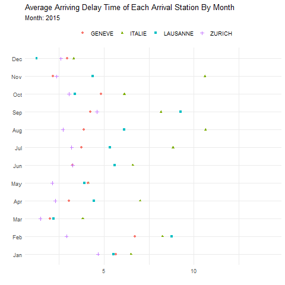
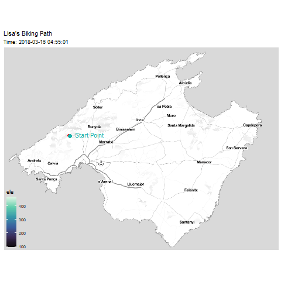
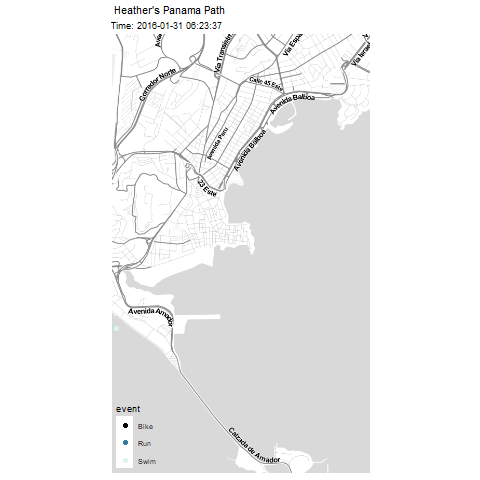
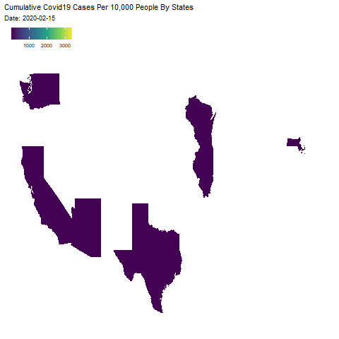

```r
library(tidyverse)     # for data cleaning and plotting
library(gardenR)       # for Lisa's garden data
library(lubridate)     # for date manipulation
library(openintro)     # for the abbr2state() function
library(palmerpenguins)# for Palmer penguin data
library(maps)          # for map data
library(ggmap)         # for mapping points on maps
library(gplots)        # for col2hex() function
library(RColorBrewer)  # for color palettes
library(sf)            # for working with spatial data
library(leaflet)       # for highly customizable mapping
library(ggthemes)      # for more themes (including theme_map())
library(plotly)        # for the ggplotly() - basic interactivity
library(gganimate)     # for adding animation layers to ggplots
library(transformr)    # for "tweening" (gganimate)
library(gifski)        # need the library for creating gifs but don't need to load each time
library(shiny)         # for creating interactive apps
theme_set(theme_minimal())
```


```r
# SNCF Train data
small_trains <- read_csv("https://raw.githubusercontent.com/rfordatascience/tidytuesday/master/data/2019/2019-02-26/small_trains.csv") 

# Lisa's garden data
data("garden_harvest")

# Lisa's Mallorca cycling data
mallorca_bike_day7 <- read_csv("https://www.dropbox.com/s/zc6jan4ltmjtvy0/mallorca_bike_day7.csv?dl=1") %>% 
  select(1:4, speed)

# Heather Lendway's Ironman 70.3 Pan Am championships Panama data
panama_swim <- read_csv("https://raw.githubusercontent.com/llendway/gps-data/master/data/panama_swim_20160131.csv")

panama_bike <- read_csv("https://raw.githubusercontent.com/llendway/gps-data/master/data/panama_bike_20160131.csv")

panama_run <- read_csv("https://raw.githubusercontent.com/llendway/gps-data/master/data/panama_run_20160131.csv")

#COVID-19 data from the New York Times
covid19 <- read_csv("https://raw.githubusercontent.com/nytimes/covid-19-data/master/us-states.csv")

# Tidy Tuesday dog breed data
breed_traits <- readr::read_csv('https://raw.githubusercontent.com/rfordatascience/tidytuesday/master/data/2022/2022-02-01/breed_traits.csv')
trait_description <- readr::read_csv('https://raw.githubusercontent.com/rfordatascience/tidytuesday/master/data/2022/2022-02-01/trait_description.csv')
breed_rank_all <- readr::read_csv('https://raw.githubusercontent.com/rfordatascience/tidytuesday/master/data/2022/2022-02-01/breed_rank.csv')

data_site <- 
  "https://www.macalester.edu/~dshuman1/data/112/2014-Q4-Trips-History-Data-Small.rds" 
Trips <- readRDS(gzcon(url(data_site)))
Stations<-read_csv("http://www.macalester.edu/~dshuman1/data/112/DC-Stations.csv")
```

## Put your homework on GitHub!

Go [here](https://github.com/llendway/github_for_collaboration/blob/master/github_for_collaboration.md) or to previous homework to remind yourself how to get set up. 

Once your repository is created, you should always open your **project** rather than just opening an .Rmd file. You can do that by either clicking on the .Rproj file in your repository folder on your computer. Or, by going to the upper right hand corner in R Studio and clicking the arrow next to where it says Project: (None). You should see your project come up in that list if you've used it recently. You could also go to File --> Open Project and navigate to your .Rproj file. 

## Instructions

* Put your name at the top of the document. 

* **For ALL graphs, you should include appropriate labels and alt text.** 

* Feel free to change the default theme, which I currently have set to `theme_minimal()`. 

* Use good coding practice. Read the short sections on good code with [pipes](https://style.tidyverse.org/pipes.html) and [ggplot2](https://style.tidyverse.org/ggplot2.html). **This is part of your grade!**

* **NEW!!** With animated graphs, add `eval=FALSE` to the code chunk that creates the animation and saves it using `anim_save()`. Add another code chunk to reread the gif back into the file. See the [tutorial](https://animation-and-interactivity-in-r.netlify.app/) for help. 

* When you are finished with ALL the exercises, uncomment the options at the top so your document looks nicer. Don't do it before then, or else you might miss some important warnings and messages.

## Warm-up exercises from tutorial

  1. Choose 2 graphs you have created for ANY assignment in this class and add interactivity using the `ggplotly()` function.
  

```r
#dog
breed_traits_total<-breed_traits %>% 
 select(-c("Coat Type", "Coat Length")) %>% 
  pivot_longer(!Breed, names_to = "level", values_to = "rating") %>% 
  group_by(Breed) %>% 
  summarise(total_rating=sum(rating))

newb_breed_traits_total <- breed_traits_total %>%
  mutate(breedR = str_squish(Breed)) %>%
  slice_max(n = 20, order_by = total_rating)

new_breed_rank_all <- breed_rank_all %>%
  pivot_longer(cols = `2013 Rank`:`2020 Rank`,
               names_to = "year",
               values_to = "rank") %>%
  separate(
    col = year,
    into = c("years", NULL),
    sep = " ",
    convert = TRUE
  ) %>%
  mutate(breedR = str_squish(Breed)) %>%
  inner_join(newb_breed_traits_total,
             by = "breedR")

new_breed_rank_all_graph <- new_breed_rank_all %>%
  ggplot(aes(y = fct_rev(fct_reorder(breedR, rank, median)), x = years)) +
  geom_line() +
  geom_point(aes(color = rank)) +
  labs(title = "Breeds Ranked By Years", x = NULL, y =
         "Breeds")

ggplotly(new_breed_rank_all_graph, tooltip = c("text","colour") )
```

```{=html}
<div id="htmlwidget-deef651cf4b77b2ab5b4" style="width:672px;height:480px;" class="plotly html-widget"></div>
<script type="application/json" data-for="htmlwidget-deef651cf4b77b2ab5b4">{"x":{"data":[{"x":[2013,2014,2015,2016,2017,2018,2019,2020,null,2013,2014,2015,2016,2017,2018,2019,2020,null,2013,2014,2015,2016,2017,2018,2019,2020,null,2013,2014,2015,2016,2017,2018,2019,2020,null,2013,2014,2015,2016,2017,2018,2019,2020,null,2013,2014,2015,2016,2017,2018,2019,2020,null,2013,2014,2015,2016,2017,2018,2019,2020,null,2013,2014,2015,2016,2017,2018,2019,2020,null,2013,2014,2015,2016,2017,2018,2019,2020,null,2013,2014,2015,2016,2017,2018,2019,2020,null,2013,2014,2015,2016,2017,2018,2019,2020,null,2013,2014,2015,2016,2017,2018,2019,2020,null,2013,2014,2015,2016,2017,2018,2019,2020,null,2013,2014,2015,2016,2017,2018,2019,2020,null,2013,2014,2015,2016,2017,2018,2019,2020,null,2013,2014,2015,2016,2017,2018,2019,2020,null,2013,2014,2015,2016,2017,2018,2019,2020,null,2013,2014,2015,2016,2017,2018,2019,2020,null,2013,2014,2015,2016,2017,2018,2019,2020,null,2013,2014,2015,2016,2017,2018,2019,2020],"y":[1,1,1,1,1,1,1,1,null,2,2,2,2,2,2,2,2,null,3,3,3,3,3,3,3,3,null,4,4,4,4,4,4,4,4,null,5,5,5,5,5,5,5,5,null,6,6,6,6,6,6,6,6,null,7,7,7,7,7,7,7,7,null,8,8,8,8,8,8,8,8,null,9,9,9,9,9,9,9,9,null,10,10,10,10,10,10,10,10,null,11,11,11,11,11,11,11,11,null,12,12,12,12,12,12,12,12,null,13,13,13,13,13,13,13,13,null,14,14,14,14,14,14,14,14,null,15,15,15,15,15,15,15,15,null,16,16,16,16,16,16,16,16,null,17,17,17,17,17,17,17,17,null,18,18,18,18,18,18,18,18,null,19,19,19,19,19,19,19,19,null,20,20,20,20,20,20,20,20],"text":"","type":"scatter","mode":"lines","line":{"width":1.88976377952756,"color":"rgba(0,0,0,1)","dash":"solid"},"hoveron":"points","showlegend":false,"xaxis":"x","yaxis":"y","hoverinfo":"text","frame":null},{"x":[2013,2014,2015,2016,2017,2018,2019,2020,2013,2014,2015,2016,2017,2018,2019,2020,2013,2014,2015,2016,2017,2018,2019,2020,2013,2014,2015,2016,2017,2018,2019,2020,2013,2014,2015,2016,2017,2018,2019,2020,2013,2014,2015,2016,2017,2018,2019,2020,2013,2014,2015,2016,2017,2018,2019,2020,2013,2014,2015,2016,2017,2018,2019,2020,2013,2014,2015,2016,2017,2018,2019,2020,2013,2014,2015,2016,2017,2018,2019,2020,2013,2014,2015,2016,2017,2018,2019,2020,2013,2014,2015,2016,2017,2018,2019,2020,2013,2014,2015,2016,2017,2018,2019,2020,2013,2014,2015,2016,2017,2018,2019,2020,2013,2014,2015,2016,2017,2018,2019,2020,2013,2014,2015,2016,2017,2018,2019,2020,2013,2014,2015,2016,2017,2018,2019,2020,2013,2014,2015,2016,2017,2018,2019,2020,2013,2014,2015,2016,2017,2018,2019,2020,2013,2014,2015,2016,2017,2018,2019,2020],"y":[20,20,20,20,20,20,20,20,19,19,19,19,19,19,19,19,18,18,18,18,18,18,18,18,16,16,16,16,16,16,16,16,17,17,17,17,17,17,17,17,15,15,15,15,15,15,15,15,13,13,13,13,13,13,13,13,14,14,14,14,14,14,14,14,1,1,1,1,1,1,1,1,12,12,12,12,12,12,12,12,11,11,11,11,11,11,11,11,10,10,10,10,10,10,10,10,9,9,9,9,9,9,9,9,8,8,8,8,8,8,8,8,7,7,7,7,7,7,7,7,6,6,6,6,6,6,6,6,5,5,5,5,5,5,5,5,3,3,3,3,3,3,3,3,4,4,4,4,4,4,4,4,2,2,2,2,2,2,2,2],"text":["rank:   1","rank:   1","rank:   1","rank:   1","rank:   1","rank:   1","rank:   1","rank:   1","rank:   2","rank:   2","rank:   2","rank:   2","rank:   2","rank:   2","rank:   2","rank:   3","rank:   8","rank:   7","rank:   8","rank:   7","rank:   7","rank:   7","rank:   6","rank:   6","rank:  13","rank:  12","rank:  11","rank:  11","rank:  10","rank:   9","rank:   9","rank:   9","rank:   6","rank:   6","rank:   7","rank:   9","rank:   9","rank:  10","rank:  12","rank:  13","rank:  17","rank:  16","rank:  16","rank:  17","rank:  18","rank:  19","rank:  18","rank:  19","rank:  32","rank:  32","rank:  29","rank:  27","rank:  25","rank:  22","rank:  23","rank:  22","rank:  21","rank:  21","rank:  23","rank:  24","rank:  24","rank:  25","rank:  25","rank:  27","rank:  NA","rank:  NA","rank:  NA","rank:  NA","rank:  NA","rank:  NA","rank:  NA","rank:  31","rank:  34","rank:  34","rank:  32","rank:  31","rank:  30","rank:  31","rank:  34","rank:  35","rank:  33","rank:  35","rank:  34","rank:  34","rank:  34","rank:  36","rank:  39","rank:  39","rank:  49","rank:  52","rank:  52","rank:  51","rank:  54","rank:  50","rank:  49","rank:  49","rank:  38","rank:  43","rank:  48","rank:  53","rank:  53","rank:  54","rank:  53","rank:  53","rank:  67","rank:  68","rank:  61","rank:  65","rank:  57","rank:  59","rank:  59","rank:  56","rank:  80","rank:  76","rank:  66","rank:  66","rank:  65","rank:  65","rank:  63","rank:  63","rank:  72","rank:  73","rank:  72","rank:  76","rank:  72","rank:  77","rank:  80","rank:  75","rank:  86","rank:  87","rank:  84","rank:  92","rank:  87","rank:  95","rank:  89","rank:  96","rank:  98","rank: 104","rank:  93","rank:  95","rank: 100","rank:  93","rank:  97","rank:  98","rank:  94","rank:  92","rank:  86","rank:  89","rank:  96","rank:  91","rank: 106","rank: 102","rank: 101","rank: 112","rank: 117","rank: 137","rank: 131","rank: 137","rank: 131","rank: 153"],"type":"scatter","mode":"markers","marker":{"autocolorscale":false,"color":["rgba(19,43,67,1)","rgba(19,43,67,1)","rgba(19,43,67,1)","rgba(19,43,67,1)","rgba(19,43,67,1)","rgba(19,43,67,1)","rgba(19,43,67,1)","rgba(19,43,67,1)","rgba(19,44,68,1)","rgba(19,44,68,1)","rgba(19,44,68,1)","rgba(19,44,68,1)","rgba(19,44,68,1)","rgba(19,44,68,1)","rgba(19,44,68,1)","rgba(20,45,69,1)","rgba(22,48,74,1)","rgba(21,48,73,1)","rgba(22,48,74,1)","rgba(21,48,73,1)","rgba(21,48,73,1)","rgba(21,48,73,1)","rgba(21,47,72,1)","rgba(21,47,72,1)","rgba(24,52,80,1)","rgba(23,52,79,1)","rgba(23,51,77,1)","rgba(23,51,77,1)","rgba(23,50,76,1)","rgba(22,49,75,1)","rgba(22,49,75,1)","rgba(22,49,75,1)","rgba(21,47,72,1)","rgba(21,47,72,1)","rgba(21,48,73,1)","rgba(22,49,75,1)","rgba(22,49,75,1)","rgba(23,50,76,1)","rgba(23,52,79,1)","rgba(24,52,80,1)","rgba(25,55,84,1)","rgba(25,55,83,1)","rgba(25,55,83,1)","rgba(25,55,84,1)","rgba(26,56,85,1)","rgba(26,57,86,1)","rgba(26,56,85,1)","rgba(26,57,86,1)","rgba(31,68,100,1)","rgba(31,68,100,1)","rgba(30,65,97,1)","rgba(29,64,95,1)","rgba(29,62,92,1)","rgba(27,59,89,1)","rgba(28,60,90,1)","rgba(27,59,89,1)","rgba(27,59,88,1)","rgba(27,59,88,1)","rgba(28,60,90,1)","rgba(28,61,91,1)","rgba(28,61,91,1)","rgba(29,62,92,1)","rgba(29,62,92,1)","rgba(29,64,95,1)","rgba(127,127,127,1)","rgba(127,127,127,1)","rgba(127,127,127,1)","rgba(127,127,127,1)","rgba(127,127,127,1)","rgba(127,127,127,1)","rgba(127,127,127,1)","rgba(31,67,99,1)","rgba(32,69,102,1)","rgba(32,69,102,1)","rgba(31,68,100,1)","rgba(31,67,99,1)","rgba(31,66,98,1)","rgba(31,67,99,1)","rgba(32,69,102,1)","rgba(33,70,104,1)","rgba(32,68,101,1)","rgba(33,70,104,1)","rgba(32,69,102,1)","rgba(32,69,102,1)","rgba(32,69,102,1)","rgba(33,71,105,1)","rgba(34,73,108,1)","rgba(34,73,108,1)","rgba(39,82,119,1)","rgba(40,84,123,1)","rgba(40,84,123,1)","rgba(39,84,122,1)","rgba(41,86,125,1)","rgba(39,83,120,1)","rgba(39,82,119,1)","rgba(39,82,119,1)","rgba(34,73,107,1)","rgba(36,77,112,1)","rgba(38,81,118,1)","rgba(40,85,124,1)","rgba(40,85,124,1)","rgba(41,86,125,1)","rgba(40,85,124,1)","rgba(40,85,124,1)","rgba(46,97,140,1)","rgba(47,98,141,1)","rgba(44,92,133,1)","rgba(46,96,138,1)","rgba(42,89,128,1)","rgba(43,90,131,1)","rgba(43,90,131,1)","rgba(42,88,127,1)","rgba(52,109,156,1)","rgba(50,105,151,1)","rgba(46,96,139,1)","rgba(46,96,139,1)","rgba(46,96,138,1)","rgba(46,96,138,1)","rgba(45,94,135,1)","rgba(45,94,135,1)","rgba(49,102,146,1)","rgba(49,103,147,1)","rgba(49,102,146,1)","rgba(50,105,151,1)","rgba(49,102,146,1)","rgba(51,106,152,1)","rgba(52,109,156,1)","rgba(50,104,150,1)","rgba(55,114,163,1)","rgba(55,115,164,1)","rgba(54,112,160,1)","rgba(57,120,170,1)","rgba(55,115,164,1)","rgba(59,122,174,1)","rgba(56,117,166,1)","rgba(59,123,175,1)","rgba(60,125,177,1)","rgba(63,131,185,1)","rgba(58,120,171,1)","rgba(59,122,174,1)","rgba(61,127,180,1)","rgba(58,120,171,1)","rgba(60,124,176,1)","rgba(60,125,177,1)","rgba(58,121,172,1)","rgba(57,120,170,1)","rgba(55,114,163,1)","rgba(56,117,166,1)","rgba(59,123,175,1)","rgba(57,119,169,1)","rgba(64,132,187,1)","rgba(62,129,182,1)","rgba(62,128,181,1)","rgba(67,138,195,1)","rgba(69,143,201,1)","rgba(78,162,226,1)","rgba(76,156,219,1)","rgba(78,162,226,1)","rgba(76,156,219,1)","rgba(86,177,247,1)"],"opacity":1,"size":5.66929133858268,"symbol":"circle","line":{"width":1.88976377952756,"color":["rgba(19,43,67,1)","rgba(19,43,67,1)","rgba(19,43,67,1)","rgba(19,43,67,1)","rgba(19,43,67,1)","rgba(19,43,67,1)","rgba(19,43,67,1)","rgba(19,43,67,1)","rgba(19,44,68,1)","rgba(19,44,68,1)","rgba(19,44,68,1)","rgba(19,44,68,1)","rgba(19,44,68,1)","rgba(19,44,68,1)","rgba(19,44,68,1)","rgba(20,45,69,1)","rgba(22,48,74,1)","rgba(21,48,73,1)","rgba(22,48,74,1)","rgba(21,48,73,1)","rgba(21,48,73,1)","rgba(21,48,73,1)","rgba(21,47,72,1)","rgba(21,47,72,1)","rgba(24,52,80,1)","rgba(23,52,79,1)","rgba(23,51,77,1)","rgba(23,51,77,1)","rgba(23,50,76,1)","rgba(22,49,75,1)","rgba(22,49,75,1)","rgba(22,49,75,1)","rgba(21,47,72,1)","rgba(21,47,72,1)","rgba(21,48,73,1)","rgba(22,49,75,1)","rgba(22,49,75,1)","rgba(23,50,76,1)","rgba(23,52,79,1)","rgba(24,52,80,1)","rgba(25,55,84,1)","rgba(25,55,83,1)","rgba(25,55,83,1)","rgba(25,55,84,1)","rgba(26,56,85,1)","rgba(26,57,86,1)","rgba(26,56,85,1)","rgba(26,57,86,1)","rgba(31,68,100,1)","rgba(31,68,100,1)","rgba(30,65,97,1)","rgba(29,64,95,1)","rgba(29,62,92,1)","rgba(27,59,89,1)","rgba(28,60,90,1)","rgba(27,59,89,1)","rgba(27,59,88,1)","rgba(27,59,88,1)","rgba(28,60,90,1)","rgba(28,61,91,1)","rgba(28,61,91,1)","rgba(29,62,92,1)","rgba(29,62,92,1)","rgba(29,64,95,1)","rgba(127,127,127,1)","rgba(127,127,127,1)","rgba(127,127,127,1)","rgba(127,127,127,1)","rgba(127,127,127,1)","rgba(127,127,127,1)","rgba(127,127,127,1)","rgba(31,67,99,1)","rgba(32,69,102,1)","rgba(32,69,102,1)","rgba(31,68,100,1)","rgba(31,67,99,1)","rgba(31,66,98,1)","rgba(31,67,99,1)","rgba(32,69,102,1)","rgba(33,70,104,1)","rgba(32,68,101,1)","rgba(33,70,104,1)","rgba(32,69,102,1)","rgba(32,69,102,1)","rgba(32,69,102,1)","rgba(33,71,105,1)","rgba(34,73,108,1)","rgba(34,73,108,1)","rgba(39,82,119,1)","rgba(40,84,123,1)","rgba(40,84,123,1)","rgba(39,84,122,1)","rgba(41,86,125,1)","rgba(39,83,120,1)","rgba(39,82,119,1)","rgba(39,82,119,1)","rgba(34,73,107,1)","rgba(36,77,112,1)","rgba(38,81,118,1)","rgba(40,85,124,1)","rgba(40,85,124,1)","rgba(41,86,125,1)","rgba(40,85,124,1)","rgba(40,85,124,1)","rgba(46,97,140,1)","rgba(47,98,141,1)","rgba(44,92,133,1)","rgba(46,96,138,1)","rgba(42,89,128,1)","rgba(43,90,131,1)","rgba(43,90,131,1)","rgba(42,88,127,1)","rgba(52,109,156,1)","rgba(50,105,151,1)","rgba(46,96,139,1)","rgba(46,96,139,1)","rgba(46,96,138,1)","rgba(46,96,138,1)","rgba(45,94,135,1)","rgba(45,94,135,1)","rgba(49,102,146,1)","rgba(49,103,147,1)","rgba(49,102,146,1)","rgba(50,105,151,1)","rgba(49,102,146,1)","rgba(51,106,152,1)","rgba(52,109,156,1)","rgba(50,104,150,1)","rgba(55,114,163,1)","rgba(55,115,164,1)","rgba(54,112,160,1)","rgba(57,120,170,1)","rgba(55,115,164,1)","rgba(59,122,174,1)","rgba(56,117,166,1)","rgba(59,123,175,1)","rgba(60,125,177,1)","rgba(63,131,185,1)","rgba(58,120,171,1)","rgba(59,122,174,1)","rgba(61,127,180,1)","rgba(58,120,171,1)","rgba(60,124,176,1)","rgba(60,125,177,1)","rgba(58,121,172,1)","rgba(57,120,170,1)","rgba(55,114,163,1)","rgba(56,117,166,1)","rgba(59,123,175,1)","rgba(57,119,169,1)","rgba(64,132,187,1)","rgba(62,129,182,1)","rgba(62,128,181,1)","rgba(67,138,195,1)","rgba(69,143,201,1)","rgba(78,162,226,1)","rgba(76,156,219,1)","rgba(78,162,226,1)","rgba(76,156,219,1)","rgba(86,177,247,1)"]}},"hoveron":"points","showlegend":false,"xaxis":"x","yaxis":"y","hoverinfo":"text","frame":null},{"x":[2014],"y":[1],"name":"99_57f7b93b52ea9433ebc9af98ce548174","type":"scatter","mode":"markers","opacity":0,"hoverinfo":"skip","showlegend":false,"marker":{"color":[0,1],"colorscale":[[0,"#132B43"],[0.00334448160535117,"#132B44"],[0.00668896321070234,"#132C44"],[0.0100334448160535,"#142C45"],[0.0133779264214047,"#142D45"],[0.0167224080267559,"#142D46"],[0.020066889632107,"#142D46"],[0.0234113712374582,"#142E47"],[0.0267558528428094,"#152E47"],[0.0301003344481605,"#152F48"],[0.0334448160535117,"#152F48"],[0.0367892976588629,"#152F49"],[0.040133779264214,"#153049"],[0.0434782608695652,"#16304A"],[0.0468227424749164,"#16304A"],[0.0501672240802676,"#16314B"],[0.0535117056856187,"#16314B"],[0.0568561872909699,"#16324C"],[0.0602006688963211,"#17324D"],[0.0635451505016722,"#17324D"],[0.0668896321070234,"#17334E"],[0.0702341137123746,"#17334E"],[0.0735785953177257,"#17344F"],[0.0769230769230769,"#18344F"],[0.0802675585284281,"#183450"],[0.0836120401337793,"#183550"],[0.0869565217391304,"#183551"],[0.0903010033444816,"#183651"],[0.0936454849498328,"#193652"],[0.0969899665551839,"#193652"],[0.100334448160535,"#193753"],[0.103678929765886,"#193754"],[0.107023411371237,"#193854"],[0.110367892976589,"#1A3855"],[0.11371237458194,"#1A3955"],[0.117056856187291,"#1A3956"],[0.120401337792642,"#1A3956"],[0.123745819397993,"#1A3A57"],[0.127090301003344,"#1B3A57"],[0.130434782608696,"#1B3B58"],[0.133779264214047,"#1B3B59"],[0.137123745819398,"#1B3B59"],[0.140468227424749,"#1C3C5A"],[0.1438127090301,"#1C3C5A"],[0.147157190635451,"#1C3D5B"],[0.150501672240803,"#1C3D5B"],[0.153846153846154,"#1C3D5C"],[0.157190635451505,"#1D3E5C"],[0.160535117056856,"#1D3E5D"],[0.163879598662207,"#1D3F5D"],[0.167224080267559,"#1D3F5E"],[0.17056856187291,"#1D3F5F"],[0.173913043478261,"#1E405F"],[0.177257525083612,"#1E4060"],[0.180602006688963,"#1E4160"],[0.183946488294314,"#1E4161"],[0.187290969899666,"#1E4261"],[0.190635451505017,"#1F4262"],[0.193979933110368,"#1F4263"],[0.197324414715719,"#1F4363"],[0.20066889632107,"#1F4364"],[0.204013377926421,"#1F4464"],[0.207357859531773,"#204465"],[0.210702341137124,"#204465"],[0.214046822742475,"#204566"],[0.217391304347826,"#204566"],[0.220735785953177,"#214667"],[0.224080267558528,"#214668"],[0.22742474916388,"#214768"],[0.230769230769231,"#214769"],[0.234113712374582,"#214769"],[0.237458193979933,"#22486A"],[0.240802675585284,"#22486A"],[0.244147157190635,"#22496B"],[0.247491638795987,"#22496C"],[0.250836120401338,"#224A6C"],[0.254180602006689,"#234A6D"],[0.25752508361204,"#234A6D"],[0.260869565217391,"#234B6E"],[0.264214046822742,"#234B6E"],[0.267558528428094,"#244C6F"],[0.270903010033445,"#244C70"],[0.274247491638796,"#244C70"],[0.277591973244147,"#244D71"],[0.280936454849498,"#244D71"],[0.284280936454849,"#254E72"],[0.287625418060201,"#254E72"],[0.290969899665552,"#254F73"],[0.294314381270903,"#254F74"],[0.297658862876254,"#254F74"],[0.301003344481605,"#265075"],[0.304347826086957,"#265075"],[0.307692307692308,"#265176"],[0.311036789297659,"#265176"],[0.31438127090301,"#275277"],[0.317725752508361,"#275278"],[0.321070234113712,"#275278"],[0.324414715719064,"#275379"],[0.327759197324415,"#275379"],[0.331103678929766,"#28547A"],[0.334448160535117,"#28547B"],[0.337792642140468,"#28557B"],[0.341137123745819,"#28557C"],[0.344481605351171,"#28567C"],[0.347826086956522,"#29567D"],[0.351170568561873,"#29567D"],[0.354515050167224,"#29577E"],[0.357859531772575,"#29577F"],[0.361204013377926,"#2A587F"],[0.364548494983278,"#2A5880"],[0.367892976588629,"#2A5980"],[0.37123745819398,"#2A5981"],[0.374581939799331,"#2A5982"],[0.377926421404682,"#2B5A82"],[0.381270903010033,"#2B5A83"],[0.384615384615385,"#2B5B83"],[0.387959866220736,"#2B5B84"],[0.391304347826087,"#2C5C85"],[0.394648829431438,"#2C5C85"],[0.397993311036789,"#2C5D86"],[0.40133779264214,"#2C5D86"],[0.404682274247492,"#2C5D87"],[0.408026755852843,"#2D5E87"],[0.411371237458194,"#2D5E88"],[0.414715719063545,"#2D5F89"],[0.418060200668896,"#2D5F89"],[0.421404682274247,"#2E608A"],[0.424749163879599,"#2E608A"],[0.42809364548495,"#2E618B"],[0.431438127090301,"#2E618C"],[0.434782608695652,"#2E618C"],[0.438127090301003,"#2F628D"],[0.441471571906355,"#2F628D"],[0.444816053511706,"#2F638E"],[0.448160535117057,"#2F638F"],[0.451505016722408,"#30648F"],[0.454849498327759,"#306490"],[0.45819397993311,"#306590"],[0.461538461538462,"#306591"],[0.464882943143813,"#306592"],[0.468227424749164,"#316692"],[0.471571906354515,"#316693"],[0.474916387959866,"#316793"],[0.478260869565217,"#316794"],[0.481605351170569,"#326895"],[0.48494983277592,"#326895"],[0.488294314381271,"#326996"],[0.491638795986622,"#326996"],[0.494983277591973,"#326997"],[0.498327759197324,"#336A98"],[0.501672240802676,"#336A98"],[0.505016722408027,"#336B99"],[0.508361204013378,"#336B99"],[0.511705685618729,"#346C9A"],[0.51505016722408,"#346C9B"],[0.518394648829431,"#346D9B"],[0.521739130434783,"#346D9C"],[0.525083612040134,"#346E9D"],[0.528428093645485,"#356E9D"],[0.531772575250836,"#356E9E"],[0.535117056856187,"#356F9E"],[0.538461538461538,"#356F9F"],[0.54180602006689,"#3670A0"],[0.545150501672241,"#3670A0"],[0.548494983277592,"#3671A1"],[0.551839464882943,"#3671A1"],[0.555183946488294,"#3772A2"],[0.558528428093645,"#3772A3"],[0.561872909698997,"#3773A3"],[0.565217391304348,"#3773A4"],[0.568561872909699,"#3773A4"],[0.57190635451505,"#3874A5"],[0.575250836120401,"#3874A6"],[0.578595317725752,"#3875A6"],[0.581939799331104,"#3875A7"],[0.585284280936455,"#3976A8"],[0.588628762541806,"#3976A8"],[0.591973244147157,"#3977A9"],[0.595317725752508,"#3977A9"],[0.598662207357859,"#3978AA"],[0.602006688963211,"#3A78AB"],[0.605351170568562,"#3A79AB"],[0.608695652173913,"#3A79AC"],[0.612040133779264,"#3A79AC"],[0.615384615384615,"#3B7AAD"],[0.618729096989967,"#3B7AAE"],[0.622073578595318,"#3B7BAE"],[0.625418060200669,"#3B7BAF"],[0.62876254180602,"#3C7CB0"],[0.632107023411371,"#3C7CB0"],[0.635451505016722,"#3C7DB1"],[0.638795986622074,"#3C7DB1"],[0.642140468227425,"#3C7EB2"],[0.645484949832776,"#3D7EB3"],[0.648829431438127,"#3D7FB3"],[0.652173913043478,"#3D7FB4"],[0.655518394648829,"#3D7FB5"],[0.658862876254181,"#3E80B5"],[0.662207357859532,"#3E80B6"],[0.665551839464883,"#3E81B6"],[0.668896321070234,"#3E81B7"],[0.672240802675585,"#3F82B8"],[0.675585284280936,"#3F82B8"],[0.678929765886288,"#3F83B9"],[0.682274247491639,"#3F83BA"],[0.68561872909699,"#4084BA"],[0.688963210702341,"#4084BB"],[0.692307692307692,"#4085BB"],[0.695652173913043,"#4085BC"],[0.698996655518395,"#4086BD"],[0.702341137123746,"#4186BD"],[0.705685618729097,"#4186BE"],[0.709030100334448,"#4187BF"],[0.712374581939799,"#4187BF"],[0.71571906354515,"#4288C0"],[0.719063545150502,"#4288C1"],[0.722408026755853,"#4289C1"],[0.725752508361204,"#4289C2"],[0.729096989966555,"#438AC2"],[0.732441471571906,"#438AC3"],[0.735785953177258,"#438BC4"],[0.739130434782609,"#438BC4"],[0.74247491638796,"#438CC5"],[0.745819397993311,"#448CC6"],[0.749163879598662,"#448DC6"],[0.752508361204013,"#448DC7"],[0.755852842809365,"#448EC8"],[0.759197324414716,"#458EC8"],[0.762541806020067,"#458FC9"],[0.765886287625418,"#458FC9"],[0.769230769230769,"#458FCA"],[0.77257525083612,"#4690CB"],[0.775919732441471,"#4690CB"],[0.779264214046823,"#4691CC"],[0.782608695652174,"#4691CD"],[0.785953177257525,"#4792CD"],[0.789297658862876,"#4792CE"],[0.792642140468227,"#4793CF"],[0.795986622073579,"#4793CF"],[0.79933110367893,"#4894D0"],[0.802675585284281,"#4894D0"],[0.806020066889632,"#4895D1"],[0.809364548494983,"#4895D2"],[0.812709030100334,"#4896D2"],[0.816053511705686,"#4996D3"],[0.819397993311037,"#4997D4"],[0.822742474916388,"#4997D4"],[0.826086956521739,"#4998D5"],[0.82943143812709,"#4A98D6"],[0.832775919732441,"#4A99D6"],[0.836120401337793,"#4A99D7"],[0.839464882943144,"#4A9AD8"],[0.842809364548495,"#4B9AD8"],[0.846153846153846,"#4B9BD9"],[0.849498327759197,"#4B9BDA"],[0.852842809364549,"#4B9BDA"],[0.8561872909699,"#4C9CDB"],[0.859531772575251,"#4C9CDB"],[0.862876254180602,"#4C9DDC"],[0.866220735785953,"#4C9DDD"],[0.869565217391304,"#4D9EDD"],[0.872909698996656,"#4D9EDE"],[0.876254180602007,"#4D9FDF"],[0.879598662207358,"#4D9FDF"],[0.882943143812709,"#4DA0E0"],[0.88628762541806,"#4EA0E1"],[0.889632107023411,"#4EA1E1"],[0.892976588628763,"#4EA1E2"],[0.896321070234114,"#4EA2E3"],[0.899665551839465,"#4FA2E3"],[0.903010033444816,"#4FA3E4"],[0.906354515050167,"#4FA3E5"],[0.909698996655518,"#4FA4E5"],[0.91304347826087,"#50A4E6"],[0.916387959866221,"#50A5E7"],[0.919732441471572,"#50A5E7"],[0.923076923076923,"#50A6E8"],[0.926421404682274,"#51A6E8"],[0.929765886287625,"#51A7E9"],[0.933110367892977,"#51A7EA"],[0.936454849498328,"#51A8EA"],[0.939799331103679,"#52A8EB"],[0.94314381270903,"#52A9EC"],[0.946488294314381,"#52A9EC"],[0.949832775919732,"#52AAED"],[0.953177257525084,"#53AAEE"],[0.956521739130435,"#53ABEE"],[0.959866220735786,"#53ABEF"],[0.963210702341137,"#53ACF0"],[0.966555183946488,"#54ACF0"],[0.969899665551839,"#54ADF1"],[0.973244147157191,"#54ADF2"],[0.976588628762542,"#54AEF2"],[0.979933110367893,"#55AEF3"],[0.983277591973244,"#55AFF4"],[0.986622073578595,"#55AFF4"],[0.989966555183946,"#55B0F5"],[0.993311036789298,"#56B0F6"],[0.996655518394649,"#56B1F6"],[1,"#56B1F7"]],"colorbar":{"bgcolor":null,"bordercolor":null,"borderwidth":0,"thickness":23.04,"title":"rank","titlefont":{"color":"rgba(0,0,0,1)","family":"","size":14.6118721461187},"tickmode":"array","ticktext":["50","100","150"],"tickvals":[0.322368421052632,0.651315789473684,0.980263157894737],"tickfont":{"color":"rgba(0,0,0,1)","family":"","size":11.689497716895},"ticklen":2,"len":0.5}},"xaxis":"x","yaxis":"y","frame":null}],"layout":{"margin":{"t":43.7625570776256,"r":7.30593607305936,"b":25.5707762557078,"l":195.068493150685},"font":{"color":"rgba(0,0,0,1)","family":"","size":14.6118721461187},"title":{"text":"Breeds Ranked By Years","font":{"color":"rgba(0,0,0,1)","family":"","size":17.5342465753425},"x":0,"xref":"paper"},"xaxis":{"domain":[0,1],"automargin":true,"type":"linear","autorange":false,"range":[2012.65,2020.35],"tickmode":"array","ticktext":["2014","2016","2018","2020"],"tickvals":[2014,2016,2018,2020],"categoryorder":"array","categoryarray":["2014","2016","2018","2020"],"nticks":null,"ticks":"","tickcolor":null,"ticklen":3.65296803652968,"tickwidth":0,"showticklabels":true,"tickfont":{"color":"rgba(77,77,77,1)","family":"","size":11.689497716895},"tickangle":-0,"showline":false,"linecolor":null,"linewidth":0,"showgrid":true,"gridcolor":"rgba(235,235,235,1)","gridwidth":0.66417600664176,"zeroline":false,"anchor":"y","title":{"text":"","font":{"color":"rgba(0,0,0,1)","family":"","size":14.6118721461187}},"hoverformat":".2f"},"yaxis":{"domain":[0,1],"automargin":true,"type":"linear","autorange":false,"range":[0.4,20.6],"tickmode":"array","ticktext":["Miniature American Shepherds","Treeing Walker Coonhounds","Leonbergers","Retrievers (Flat-Coated)","Keeshonden","Setters (Irish)","Wirehaired Pointing Griffons","Samoyeds","Papillons","Portuguese Water Dogs","Weimaraners","Vizslas","Bernese Mountain Dogs","Shetland Sheepdogs","Miniature Schnauzers","Pointers (German Shorthaired)","Yorkshire Terriers","Poodles","German Shepherd Dogs","Retrievers (Labrador)"],"tickvals":[1,2,3,4,5,6,7,8,9,10,11,12,13,14,15,16,17,18,19,20],"categoryorder":"array","categoryarray":["Miniature American Shepherds","Treeing Walker Coonhounds","Leonbergers","Retrievers (Flat-Coated)","Keeshonden","Setters (Irish)","Wirehaired Pointing Griffons","Samoyeds","Papillons","Portuguese Water Dogs","Weimaraners","Vizslas","Bernese Mountain Dogs","Shetland Sheepdogs","Miniature Schnauzers","Pointers (German Shorthaired)","Yorkshire Terriers","Poodles","German Shepherd Dogs","Retrievers (Labrador)"],"nticks":null,"ticks":"","tickcolor":null,"ticklen":3.65296803652968,"tickwidth":0,"showticklabels":true,"tickfont":{"color":"rgba(77,77,77,1)","family":"","size":11.689497716895},"tickangle":-0,"showline":false,"linecolor":null,"linewidth":0,"showgrid":true,"gridcolor":"rgba(235,235,235,1)","gridwidth":0.66417600664176,"zeroline":false,"anchor":"x","title":{"text":"Breeds","font":{"color":"rgba(0,0,0,1)","family":"","size":14.6118721461187}},"hoverformat":".2f"},"shapes":[{"type":"rect","fillcolor":null,"line":{"color":null,"width":0,"linetype":[]},"yref":"paper","xref":"paper","x0":0,"x1":1,"y0":0,"y1":1}],"showlegend":false,"legend":{"bgcolor":null,"bordercolor":null,"borderwidth":0,"font":{"color":"rgba(0,0,0,1)","family":"","size":11.689497716895},"title":{"text":"","font":{"color":"rgba(0,0,0,1)","family":"","size":14.6118721461187}}},"hovermode":"closest","barmode":"relative"},"config":{"doubleClick":"reset","modeBarButtonsToAdd":["hoverclosest","hovercompare"],"showSendToCloud":false},"source":"A","attrs":{"545c4708b49":{"x":{},"y":{},"type":"scatter"},"545c5a0d7512":{"x":{},"y":{},"colour":{}}},"cur_data":"545c4708b49","visdat":{"545c4708b49":["function (y) ","x"],"545c5a0d7512":["function (y) ","x"]},"highlight":{"on":"plotly_click","persistent":false,"dynamic":false,"selectize":false,"opacityDim":0.2,"selected":{"opacity":1},"debounce":0},"shinyEvents":["plotly_hover","plotly_click","plotly_selected","plotly_relayout","plotly_brushed","plotly_brushing","plotly_clickannotation","plotly_doubleclick","plotly_deselect","plotly_afterplot","plotly_sunburstclick"],"base_url":"https://plot.ly"},"evals":[],"jsHooks":[]}</script>
```


```r
staTrip2 <- Trips %>%
  left_join(Stations, by = c ("sstation" = "name")) %>%
  group_by(lat, long, client) %>%
  summarise(numEventGroup = n()) %>%
  mutate(totalEvent = sum(numEventGroup)) %>%
  mutate(prop = numEventGroup / totalEvent) %>%
  pivot_wider(names_from = client, values_from = prop) %>%
  select(-c(Registered)) %>%
  distinct(totalEvent, .keep_all = TRUE) %>%
  ungroup() %>% 
  select("lat","long","Casual")

staTrip2_graph <- staTrip2 %>%
  ggplot(aes(x = long, y = lat, color = Casual)) +
  geom_point() +
  scale_color_viridis_c() +
  labs(title = "Proportion of Casual Clients' Departures From Each Station", x = "Longtitude", y =
         "Latitude")

ggplotly(staTrip2_graph , tooltip = c("text","colour") )
```

```{=html}
<div id="htmlwidget-e577247abde7bb6fbbe0" style="width:672px;height:480px;" class="plotly html-widget"></div>
<script type="application/json" data-for="htmlwidget-e577247abde7bb6fbbe0">{"x":{"data":[{"x":[-77.068952,-77.063562,-77.040363,-77.060866,-77.043363,-77.049883,-77.05293,-77.06072,-77.044664,-77.050276,-77.052808,-77.057619,-77.053096,-77.047494,-77.058541,-77.059821,-77.087323,-77.09482,-77.0502,-76.999388,-77.085931,-76.987823,-77.069275,-77.075104,-77.051516,-77.084918,-77.05152,-77.105022,-77.0498,-77.0512,-77.11153,-77.0492,-77.05332,-77.0511,-77.086733,-77.05949,-77.063275,-76.9672,-77.049593,-77.09586,-77.059936,-77.086599,-76.994637,-77.0528,-77.0633,-77.080319,-76.990037,-77.048672,-77.04826,-77.076131,-76.985238,-77.072315,-76.988039,-77.095596,-77.104503,-77.107906,-76.971015,-77.089233,-77.0057,-77.0024,-77.0037,-77.107735,-77.0178,-76.994468,-77.02127,-77.03023,-77.006004,-77.1207,-76.9953,-77.037413,-77.107673,-76.9862,-77.08596,-77.091129,-77.111768,-77.001828,-77.10396,-77.109366,-77.103148,-77.116817,-77.10783,-76.995397,-76.9861,-77.04657,-77.017445,-77.10108,-77.093485,-77.08777,-77.0023,-77.097745,-77.022241,-76.996806,-77.028226,-77.018939,-77.01397,-77.025762,-76.983569,-77.001955,-77.094875,-77.09308,-77.049426,-77.032429,-77.02858,-77.0925,-77.077294,-76.9769,-76.983326,-77.071301,-76.93723,-77.000349,-76.995193,-77.0889,-77.08095,-77.0846,-77.079375,-77.013917,-77.0436,-77.046567,-77.026013,-77.086045,-77.076701,-76.947974,-77.031617,-77.01994,-77.072305,-77.045128,-76.997114,-76.987633,-77.02324,-77.046587,-77.09169,-77.054845,-77.0436,-77.016106,-77.026064,-77.089006,-77.078107,-77.045,-77.086502,-77.00493,-76.947446,-76.983575,-77.019347,-76.994749,-77.070993,-77.022322,-77.009888,-77.080851,-77.026975,-77.031823,-77.027869,-77.024281,-77.039624,-77.0337,-77.015289,-77.031686,-77.041539,-77.023086,-77.008911,-76.998347,-76.991383,-77.029822,-77.0429,-76.9882,-77.012108,-77.001949,-76.982872,-77.047,-77.048911,-77.018677,-77.046564,-77.051084,-77.03353,-77.038322,-77.04337,-77.059219,-77.02674,-77.03863,-77.019027,-77.043648,-77.067786,-77.044789,-76.987211,-77.06269,-77.034931,-77.0284,-77.053485,-77.041606,-76.9941,-77.056887,-77.046774,-77.027137,-77.0056,-77.003041,-77.022264,-77.0325,-77.05152,-77.038785,-77.015231,-77.071652,-76.996985,-77.038359,-77.063586,-77.0323,-77.04478,-77.034438,-77.0444,-77.00495,-77.0387,-77.0135,-77.041834,-77.017669,-77.031681,-77.022155,-77.0446,-77.012289,-77.0222,-77.03818,-77.0682,-77.028139,-77.0259,-77.0321,-77.01597,-77.04062,-77.004746,-77.041571,-77.000648,-77.025672,-77.04368,-76.995876,-77.031887,-77.070334,-77.077271,-77.042581,-77.047637,-77.0352,-77.050046,-77.0222,-77.036536,-77.0322,-76.978924,-76.997194,-77.043358,-77.02344,-76.990955,-77.012457,-77.027822,-77.055599,-77.0315,-77.0388,-76.992889,-76.991016,-77.057979,-76.9955,-77.074647,-77.024649,-77.0328,-77.087171,-77.062036,-77.0251,-77.032652,-77.077078,-77.063896,-77.079382,-77.032818,-77.027333,-77.002721,-77.082426,-77.069956,-77.032947,-77.019815,-77.088659,-77.085998,-77.075946,-77.103381,-77.01121,-77.016855,-77.094589,-77.006472,-77.097426,-77.011336,-77.091991,-77.095367,-77.006311,-77.094537,-77.000035,-77.029417,-77.096539,-77.098029,-77.023854,-77.02935,-77.100239,-77.100104,-77.02918,-77.031555,-77.109647,-77.151291,-77.146866,-77.145803,-77.192672,-77.152072,-77.182669,-77.171487,-77.166093,null],"y":[38.801111,38.802677,38.803124,38.804378,38.804718,38.805317,38.805648,38.805767,38.810743,38.811456,38.814577,38.820064,38.820932,38.82175,38.82595,38.833077,38.834108,38.837666,38.8426,38.843222,38.8444,38.844711,38.846222,38.847977,38.848441,38.848454,38.850688,38.852248,38.8533,38.8561,38.856319,38.8564,38.85725,38.8573,38.857803,38.857866,38.859254,38.8601,38.86017,38.860789,38.862303,38.862478,38.862669,38.8629,38.8637,38.863833,38.863897,38.864702,38.86646,38.866471,38.866611,38.867262,38.867373,38.869418,38.869442,38.871822,38.873057,38.873755,38.8743,38.87501,38.8763,38.876393,38.8767,38.876737,38.87675,38.878433,38.87861,38.87887,38.8792,38.879819,38.880151,38.8803,38.880705,38.880834,38.881044,38.881185,38.8815,38.882629,38.882788,38.883921,38.88397,38.884,38.884,38.88412,38.88412,38.884616,38.884734,38.884961,38.8851,38.885801,38.886266,38.886952,38.887237,38.887299,38.88731,38.887312,38.88732,38.887378,38.88786,38.8881,38.888251,38.888553,38.888767,38.889,38.889365,38.8896,38.889908,38.88992,38.889935,38.889955,38.889988,38.8904,38.89054,38.891696,38.892164,38.892275,38.8923,38.892459,38.893028,38.893241,38.893648,38.894,38.894514,38.894573,38.8946,38.894722,38.894758,38.894832,38.894851,38.894919,38.894941,38.895184,38.8952,38.895344,38.895914,38.89593,38.896015,38.8963,38.896923,38.89696,38.897063,38.897195,38.897222,38.897274,38.897315,38.897324,38.897446,38.897612,38.897857,38.898069,38.898364,38.898404,38.89841,38.8991,38.899408,38.899632,38.89968,38.8997,38.899703,38.899972,38.899983,38.900283,38.9003,38.9003,38.900358,38.900412,38.900413,38.9008,38.90088,38.90093,38.901539,38.901755,38.902,38.902061,38.902204,38.9022212,38.90268,38.90276,38.90304,38.903407,38.903582,38.903584,38.903732,38.90375,38.90381,38.903819,38.903827,38.904742,38.90509,38.905126,38.90534,38.905607,38.9057,38.905707,38.90572,38.9059,38.9066,38.906602,38.90706,38.90774,38.908008,38.908142,38.90849,38.9086,38.908905,38.90985,38.9101,38.910972,38.9121,38.9126,38.912648,38.912659,38.912682,38.912719,38.9154,38.915417,38.9155,38.91554,38.916442,38.916787,38.9172,38.9176,38.917622,38.917761,38.918155,38.918809,38.919077,38.920387,38.920669,38.920682,38.921074,38.922581,38.922649,38.922925,38.923203,38.92333,38.923583,38.9249,38.926088,38.9268,38.927095,38.927497,38.927872,38.928156,38.928644,38.928743,38.929464,38.930282,38.9308,38.9319,38.932514,38.933668,38.934267,38.9346,38.934751,38.936043,38.9375,38.938736,38.941154,38.9418,38.942016,38.943837,38.944551,38.947607,38.947774,38.949662,38.952369,38.954812,38.955016,38.956432,38.956595,38.96115,38.961763,38.96497,38.964992,38.975,38.975219,38.977093,38.977933,38.981103,38.98128,38.982456,38.983525,38.983627,38.984691,38.986743,38.987,38.988562,38.98954,38.989724,38.990249,38.990639,38.992375,38.99521,38.999388,38.999634,39.084125,39.084379,39.085394,39.096312,39.107709,39.110314,39.114688,39.119765,null],"text":["Casual: 0.33333333","Casual: 0.07692308","Casual: 0.20000000","Casual: 0.60000000","Casual: 0.08333333","Casual: 0.12500000","Casual:         NA","Casual: 0.28571429","Casual: 0.16666667","Casual:         NA","Casual: 0.10000000","Casual:         NA","Casual:         NA","Casual:         NA","Casual: 0.14285714","Casual: 0.25000000","Casual: 0.33333333","Casual:         NA","Casual:         NA","Casual:         NA","Casual:         NA","Casual:         NA","Casual: 0.33333333","Casual:         NA","Casual: 0.10000000","Casual:         NA","Casual:         NA","Casual:         NA","Casual: 0.17647059","Casual: 0.25000000","Casual: 1.00000000","Casual: 0.50000000","Casual: 0.22222222","Casual: 0.09090909","Casual:         NA","Casual:         NA","Casual: 0.33333333","Casual:         NA","Casual: 0.27272727","Casual:         NA","Casual: 0.20000000","Casual:         NA","Casual:         NA","Casual: 0.07692308","Casual: 0.31250000","Casual:         NA","Casual:         NA","Casual:         NA","Casual:         NA","Casual:         NA","Casual:         NA","Casual: 0.57142857","Casual:         NA","Casual:         NA","Casual: 0.33333333","Casual:         NA","Casual:         NA","Casual:         NA","Casual:         NA","Casual: 0.07142857","Casual: 0.09090909","Casual:         NA","Casual: 0.18518519","Casual:         NA","Casual: 0.09090909","Casual: 0.10000000","Casual: 0.02173913","Casual: 0.18181818","Casual: 0.23076923","Casual: 0.61842105","Casual:         NA","Casual: 0.03333333","Casual: 0.11111111","Casual: 1.00000000","Casual: 0.05263158","Casual: 0.03225806","Casual:         NA","Casual: 0.09090909","Casual: 0.03703704","Casual:         NA","Casual:         NA","Casual: 0.12037037","Casual:         NA","Casual: 0.74468085","Casual: 0.02272727","Casual:         NA","Casual:         NA","Casual: 0.20000000","Casual: 0.04545455","Casual:         NA","Casual: 0.14864865","Casual: 0.12727273","Casual: 0.26530612","Casual: 0.52112676","Casual: 0.34782609","Casual: 0.25000000","Casual:         NA","Casual: 0.10526316","Casual: 0.20000000","Casual:         NA","Casual: 0.76158940","Casual: 0.75781250","Casual: 0.63291139","Casual: 0.09090909","Casual: 0.40000000","Casual: 0.08695652","Casual: 0.05000000","Casual: 0.25000000","Casual:         NA","Casual: 0.17543860","Casual: 0.02777778","Casual:         NA","Casual: 0.06250000","Casual: 0.09523810","Casual: 0.09090909","Casual: 0.22500000","Casual: 0.41818182","Casual: 0.58333333","Casual: 0.43902439","Casual:         NA","Casual: 0.11111111","Casual:         NA","Casual: 0.31034483","Casual: 0.26000000","Casual: 0.32000000","Casual: 0.15384615","Casual: 0.10169492","Casual: 0.06896552","Casual: 0.25641026","Casual: 0.06060606","Casual: 0.14285714","Casual: 0.12500000","Casual: 0.33333333","Casual: 0.18750000","Casual: 0.27868852","Casual: 0.04761905","Casual: 0.20000000","Casual: 0.13513514","Casual:         NA","Casual: 0.05809129","Casual:         NA","Casual:         NA","Casual: 0.04918033","Casual:         NA","Casual: 0.23913043","Casual: 0.18918919","Casual: 0.12643678","Casual:         NA","Casual: 0.20512821","Casual: 0.29230769","Casual: 0.07352941","Casual: 0.12500000","Casual: 0.28571429","Casual: 0.32911392","Casual: 0.02500000","Casual: 0.14705882","Casual: 0.11111111","Casual: 0.11494253","Casual: 0.03703704","Casual: 0.07500000","Casual:         NA","Casual: 0.18867925","Casual: 0.23913043","Casual: 0.08333333","Casual: 0.03571429","Casual: 0.06944444","Casual: 0.19047619","Casual: 0.19148936","Casual: 0.10256410","Casual: 0.12871287","Casual: 0.10000000","Casual: 0.12195122","Casual: 0.10416667","Casual: 0.13793103","Casual: 0.11111111","Casual: 0.49019608","Casual: 0.16176471","Casual: 0.04411765","Casual: 0.03571429","Casual: 0.06382979","Casual: 0.33333333","Casual: 0.05405405","Casual: 0.11111111","Casual: 0.20000000","Casual: 0.11904762","Casual: 0.06060606","Casual: 0.15384615","Casual: 0.08474576","Casual: 0.12000000","Casual: 0.24074074","Casual: 0.11594203","Casual: 0.04819277","Casual: 0.08139535","Casual: 0.05084746","Casual: 0.06896552","Casual: 0.17532468","Casual: 0.09090909","Casual: 0.18421053","Casual: 0.03846154","Casual: 0.15686275","Casual: 0.66666667","Casual: 0.10256410","Casual: 0.23404255","Casual: 0.07777778","Casual: 0.02985075","Casual: 0.08571429","Casual: 0.14507772","Casual: 0.09677419","Casual: 0.03676471","Casual: 0.07407407","Casual: 0.05000000","Casual:         NA","Casual: 0.10526316","Casual: 0.01851852","Casual: 0.04347826","Casual: 0.03846154","Casual: 0.06329114","Casual: 0.04195804","Casual: 0.19047619","Casual: 0.10126582","Casual: 0.13207547","Casual: 0.03816794","Casual:         NA","Casual: 0.09859155","Casual:         NA","Casual: 0.05555556","Casual: 0.12500000","Casual: 0.05882353","Casual: 0.03846154","Casual: 0.25000000","Casual: 0.05172414","Casual: 0.20000000","Casual: 0.10256410","Casual: 0.03738318","Casual: 0.10000000","Casual: 0.03508772","Casual: 0.11392405","Casual: 0.06896552","Casual: 0.09859155","Casual: 0.03658537","Casual:         NA","Casual:         NA","Casual: 0.30769231","Casual: 0.05405405","Casual:         NA","Casual:         NA","Casual: 0.02631579","Casual: 0.09090909","Casual: 0.02105263","Casual: 0.06756757","Casual: 0.14285714","Casual:         NA","Casual: 0.03125000","Casual:         NA","Casual:         NA","Casual: 0.15254237","Casual: 0.02500000","Casual:         NA","Casual: 0.12500000","Casual:         NA","Casual: 0.06250000","Casual: 0.12500000","Casual: 0.12500000","Casual: 0.05555556","Casual:         NA","Casual:         NA","Casual: 0.50000000","Casual:         NA","Casual:         NA","Casual: 0.10000000","Casual:         NA","Casual: 0.20000000","Casual: 0.20000000","Casual:         NA","Casual: 1.00000000","Casual:         NA","Casual:         NA","Casual:         NA","Casual:         NA","Casual: 0.28571429","Casual:         NA","Casual:         NA","Casual: 0.33333333","Casual: 0.25000000","Casual:         NA","Casual:         NA","Casual:         NA","Casual:         NA","Casual: 0.14285714","Casual:         NA","Casual:         NA","Casual:         NA","Casual: 0.33333333","Casual: 0.25000000","Casual: 1.00000000","Casual: 1.00000000","Casual:         NA","Casual:         NA","Casual:         NA","Casual: 1.00000000","Casual:         NA","Casual:         NA","Casual:         NA","Casual:         NA","Casual: 0.09289617"],"type":"scatter","mode":"markers","marker":{"autocolorscale":false,"color":["rgba(57,100,139,1)","rgba(70,27,99,1)","rgba(66,64,131,1)","rgba(35,166,132,1)","rgba(70,29,100,1)","rgba(69,42,111,1)","rgba(127,127,127,1)","rgba(61,87,138,1)","rgba(68,55,122,1)","rgba(127,127,127,1)","rgba(70,35,105,1)","rgba(127,127,127,1)","rgba(127,127,127,1)","rgba(127,127,127,1)","rgba(69,48,116,1)","rgba(64,78,136,1)","rgba(57,100,139,1)","rgba(127,127,127,1)","rgba(127,127,127,1)","rgba(127,127,127,1)","rgba(127,127,127,1)","rgba(127,127,127,1)","rgba(57,100,139,1)","rgba(127,127,127,1)","rgba(70,35,105,1)","rgba(127,127,127,1)","rgba(127,127,127,1)","rgba(127,127,127,1)","rgba(68,57,125,1)","rgba(64,78,136,1)","rgba(253,231,37,1)","rgba(43,141,138,1)","rgba(65,70,135,1)","rgba(70,32,102,1)","rgba(127,127,127,1)","rgba(127,127,127,1)","rgba(57,100,139,1)","rgba(127,127,127,1)","rgba(62,84,137,1)","rgba(127,127,127,1)","rgba(66,64,131,1)","rgba(127,127,127,1)","rgba(127,127,127,1)","rgba(70,27,99,1)","rgba(59,94,139,1)","rgba(127,127,127,1)","rgba(127,127,127,1)","rgba(127,127,127,1)","rgba(127,127,127,1)","rgba(127,127,127,1)","rgba(127,127,127,1)","rgba(39,159,134,1)","rgba(127,127,127,1)","rgba(127,127,127,1)","rgba(57,100,139,1)","rgba(127,127,127,1)","rgba(127,127,127,1)","rgba(127,127,127,1)","rgba(127,127,127,1)","rgba(69,25,97,1)","rgba(70,32,102,1)","rgba(127,127,127,1)","rgba(67,60,127,1)","rgba(127,127,127,1)","rgba(70,32,102,1)","rgba(70,35,105,1)","rgba(68,3,85,1)","rgba(67,59,126,1)","rgba(64,72,136,1)","rgba(44,170,130,1)","rgba(127,127,127,1)","rgba(69,9,88,1)","rgba(70,38,108,1)","rgba(253,231,37,1)","rgba(69,18,93,1)","rgba(69,8,87,1)","rgba(127,127,127,1)","rgba(70,32,102,1)","rgba(69,11,89,1)","rgba(127,127,127,1)","rgba(127,127,127,1)","rgba(70,41,110,1)","rgba(127,127,127,1)","rgba(104,196,99,1)","rgba(68,3,85,1)","rgba(127,127,127,1)","rgba(127,127,127,1)","rgba(66,64,131,1)","rgba(69,15,91,1)","rgba(127,127,127,1)","rgba(69,49,117,1)","rgba(69,43,112,1)","rgba(63,82,137,1)","rgba(43,147,137,1)","rgba(55,103,140,1)","rgba(64,78,136,1)","rgba(127,127,127,1)","rgba(70,36,106,1)","rgba(66,64,131,1)","rgba(127,127,127,1)","rgba(109,200,94,1)","rgba(108,199,95,1)","rgba(55,173,126,1)","rgba(70,32,102,1)","rgba(45,117,142,1)","rgba(70,31,101,1)","rgba(69,17,92,1)","rgba(64,78,136,1)","rgba(127,127,127,1)","rgba(68,57,124,1)","rgba(68,6,86,1)","rgba(127,127,127,1)","rgba(69,22,95,1)","rgba(70,33,103,1)","rgba(70,32,102,1)","rgba(65,71,135,1)","rgba(42,122,142,1)","rgba(38,162,133,1)","rgba(43,127,141,1)","rgba(127,127,127,1)","rgba(70,38,108,1)","rgba(127,127,127,1)","rgba(59,94,139,1)","rgba(63,80,137,1)","rgba(58,96,139,1)","rgba(69,51,119,1)","rgba(70,35,105,1)","rgba(69,24,97,1)","rgba(63,79,137,1)","rgba(69,21,95,1)","rgba(69,48,116,1)","rgba(69,42,111,1)","rgba(57,100,139,1)","rgba(67,60,128,1)","rgba(62,85,137,1)","rgba(69,16,91,1)","rgba(66,64,131,1)","rgba(69,46,114,1)","rgba(127,127,127,1)","rgba(69,20,94,1)","rgba(127,127,127,1)","rgba(127,127,127,1)","rgba(69,16,92,1)","rgba(127,127,127,1)","rgba(64,75,136,1)","rgba(67,61,128,1)","rgba(69,43,112,1)","rgba(127,127,127,1)","rgba(66,65,132,1)","rgba(61,89,138,1)","rgba(70,26,98,1)","rgba(69,42,111,1)","rgba(61,87,138,1)","rgba(57,99,139,1)","rgba(68,4,86,1)","rgba(69,49,117,1)","rgba(70,38,108,1)","rgba(70,39,109,1)","rgba(69,11,89,1)","rgba(70,26,98,1)","rgba(127,127,127,1)","rgba(67,61,128,1)","rgba(64,75,136,1)","rgba(70,29,100,1)","rgba(69,10,88,1)","rgba(69,25,97,1)","rgba(67,61,128,1)","rgba(67,62,129,1)","rgba(70,36,105,1)","rgba(69,44,112,1)","rgba(70,35,105,1)","rgba(70,42,110,1)","rgba(70,36,106,1)","rgba(69,46,115,1)","rgba(70,38,108,1)","rgba(44,139,138,1)","rgba(68,53,121,1)","rgba(69,14,90,1)","rgba(69,10,88,1)","rgba(69,22,95,1)","rgba(57,100,139,1)","rgba(69,19,93,1)","rgba(70,38,108,1)","rgba(66,64,131,1)","rgba(70,41,110,1)","rgba(69,21,95,1)","rgba(69,51,119,1)","rgba(70,30,101,1)","rgba(70,41,110,1)","rgba(64,75,136,1)","rgba(70,40,109,1)","rgba(69,16,91,1)","rgba(70,29,100,1)","rgba(69,17,92,1)","rgba(69,24,97,1)","rgba(68,57,124,1)","rgba(70,32,102,1)","rgba(67,60,127,1)","rgba(69,11,89,1)","rgba(69,52,120,1)","rgba(73,180,119,1)","rgba(70,36,105,1)","rgba(64,73,136,1)","rgba(70,27,99,1)","rgba(68,7,87,1)","rgba(70,30,101,1)","rgba(69,48,116,1)","rgba(70,34,104,1)","rgba(69,10,89,1)","rgba(70,26,98,1)","rgba(69,17,92,1)","rgba(127,127,127,1)","rgba(70,36,106,1)","rgba(68,1,84,1)","rgba(69,14,90,1)","rgba(69,11,89,1)","rgba(69,22,95,1)","rgba(69,13,90,1)","rgba(67,61,128,1)","rgba(70,35,105,1)","rgba(69,45,113,1)","rgba(69,11,89,1)","rgba(127,127,127,1)","rgba(70,34,104,1)","rgba(127,127,127,1)","rgba(69,19,93,1)","rgba(69,42,111,1)","rgba(69,20,94,1)","rgba(69,11,89,1)","rgba(64,78,136,1)","rgba(69,18,92,1)","rgba(66,64,131,1)","rgba(70,36,105,1)","rgba(69,11,89,1)","rgba(70,35,105,1)","rgba(69,10,88,1)","rgba(70,39,108,1)","rgba(69,24,97,1)","rgba(70,34,104,1)","rgba(69,10,89,1)","rgba(127,127,127,1)","rgba(127,127,127,1)","rgba(59,93,139,1)","rgba(69,19,93,1)","rgba(127,127,127,1)","rgba(127,127,127,1)","rgba(68,5,86,1)","rgba(70,32,102,1)","rgba(68,2,85,1)","rgba(69,24,96,1)","rgba(69,48,116,1)","rgba(127,127,127,1)","rgba(68,7,87,1)","rgba(127,127,127,1)","rgba(127,127,127,1)","rgba(69,51,118,1)","rgba(68,4,86,1)","rgba(127,127,127,1)","rgba(69,42,111,1)","rgba(127,127,127,1)","rgba(69,22,95,1)","rgba(69,42,111,1)","rgba(69,42,111,1)","rgba(69,19,93,1)","rgba(127,127,127,1)","rgba(127,127,127,1)","rgba(43,141,138,1)","rgba(127,127,127,1)","rgba(127,127,127,1)","rgba(70,35,105,1)","rgba(127,127,127,1)","rgba(66,64,131,1)","rgba(66,64,131,1)","rgba(127,127,127,1)","rgba(253,231,37,1)","rgba(127,127,127,1)","rgba(127,127,127,1)","rgba(127,127,127,1)","rgba(127,127,127,1)","rgba(61,87,138,1)","rgba(127,127,127,1)","rgba(127,127,127,1)","rgba(57,100,139,1)","rgba(64,78,136,1)","rgba(127,127,127,1)","rgba(127,127,127,1)","rgba(127,127,127,1)","rgba(127,127,127,1)","rgba(69,48,116,1)","rgba(127,127,127,1)","rgba(127,127,127,1)","rgba(127,127,127,1)","rgba(57,100,139,1)","rgba(64,78,136,1)","rgba(253,231,37,1)","rgba(253,231,37,1)","rgba(127,127,127,1)","rgba(127,127,127,1)","rgba(127,127,127,1)","rgba(253,231,37,1)","rgba(127,127,127,1)","rgba(127,127,127,1)","rgba(127,127,127,1)","rgba(127,127,127,1)","rgba(70,33,103,1)"],"opacity":1,"size":5.66929133858268,"symbol":"circle","line":{"width":1.88976377952756,"color":["rgba(57,100,139,1)","rgba(70,27,99,1)","rgba(66,64,131,1)","rgba(35,166,132,1)","rgba(70,29,100,1)","rgba(69,42,111,1)","rgba(127,127,127,1)","rgba(61,87,138,1)","rgba(68,55,122,1)","rgba(127,127,127,1)","rgba(70,35,105,1)","rgba(127,127,127,1)","rgba(127,127,127,1)","rgba(127,127,127,1)","rgba(69,48,116,1)","rgba(64,78,136,1)","rgba(57,100,139,1)","rgba(127,127,127,1)","rgba(127,127,127,1)","rgba(127,127,127,1)","rgba(127,127,127,1)","rgba(127,127,127,1)","rgba(57,100,139,1)","rgba(127,127,127,1)","rgba(70,35,105,1)","rgba(127,127,127,1)","rgba(127,127,127,1)","rgba(127,127,127,1)","rgba(68,57,125,1)","rgba(64,78,136,1)","rgba(253,231,37,1)","rgba(43,141,138,1)","rgba(65,70,135,1)","rgba(70,32,102,1)","rgba(127,127,127,1)","rgba(127,127,127,1)","rgba(57,100,139,1)","rgba(127,127,127,1)","rgba(62,84,137,1)","rgba(127,127,127,1)","rgba(66,64,131,1)","rgba(127,127,127,1)","rgba(127,127,127,1)","rgba(70,27,99,1)","rgba(59,94,139,1)","rgba(127,127,127,1)","rgba(127,127,127,1)","rgba(127,127,127,1)","rgba(127,127,127,1)","rgba(127,127,127,1)","rgba(127,127,127,1)","rgba(39,159,134,1)","rgba(127,127,127,1)","rgba(127,127,127,1)","rgba(57,100,139,1)","rgba(127,127,127,1)","rgba(127,127,127,1)","rgba(127,127,127,1)","rgba(127,127,127,1)","rgba(69,25,97,1)","rgba(70,32,102,1)","rgba(127,127,127,1)","rgba(67,60,127,1)","rgba(127,127,127,1)","rgba(70,32,102,1)","rgba(70,35,105,1)","rgba(68,3,85,1)","rgba(67,59,126,1)","rgba(64,72,136,1)","rgba(44,170,130,1)","rgba(127,127,127,1)","rgba(69,9,88,1)","rgba(70,38,108,1)","rgba(253,231,37,1)","rgba(69,18,93,1)","rgba(69,8,87,1)","rgba(127,127,127,1)","rgba(70,32,102,1)","rgba(69,11,89,1)","rgba(127,127,127,1)","rgba(127,127,127,1)","rgba(70,41,110,1)","rgba(127,127,127,1)","rgba(104,196,99,1)","rgba(68,3,85,1)","rgba(127,127,127,1)","rgba(127,127,127,1)","rgba(66,64,131,1)","rgba(69,15,91,1)","rgba(127,127,127,1)","rgba(69,49,117,1)","rgba(69,43,112,1)","rgba(63,82,137,1)","rgba(43,147,137,1)","rgba(55,103,140,1)","rgba(64,78,136,1)","rgba(127,127,127,1)","rgba(70,36,106,1)","rgba(66,64,131,1)","rgba(127,127,127,1)","rgba(109,200,94,1)","rgba(108,199,95,1)","rgba(55,173,126,1)","rgba(70,32,102,1)","rgba(45,117,142,1)","rgba(70,31,101,1)","rgba(69,17,92,1)","rgba(64,78,136,1)","rgba(127,127,127,1)","rgba(68,57,124,1)","rgba(68,6,86,1)","rgba(127,127,127,1)","rgba(69,22,95,1)","rgba(70,33,103,1)","rgba(70,32,102,1)","rgba(65,71,135,1)","rgba(42,122,142,1)","rgba(38,162,133,1)","rgba(43,127,141,1)","rgba(127,127,127,1)","rgba(70,38,108,1)","rgba(127,127,127,1)","rgba(59,94,139,1)","rgba(63,80,137,1)","rgba(58,96,139,1)","rgba(69,51,119,1)","rgba(70,35,105,1)","rgba(69,24,97,1)","rgba(63,79,137,1)","rgba(69,21,95,1)","rgba(69,48,116,1)","rgba(69,42,111,1)","rgba(57,100,139,1)","rgba(67,60,128,1)","rgba(62,85,137,1)","rgba(69,16,91,1)","rgba(66,64,131,1)","rgba(69,46,114,1)","rgba(127,127,127,1)","rgba(69,20,94,1)","rgba(127,127,127,1)","rgba(127,127,127,1)","rgba(69,16,92,1)","rgba(127,127,127,1)","rgba(64,75,136,1)","rgba(67,61,128,1)","rgba(69,43,112,1)","rgba(127,127,127,1)","rgba(66,65,132,1)","rgba(61,89,138,1)","rgba(70,26,98,1)","rgba(69,42,111,1)","rgba(61,87,138,1)","rgba(57,99,139,1)","rgba(68,4,86,1)","rgba(69,49,117,1)","rgba(70,38,108,1)","rgba(70,39,109,1)","rgba(69,11,89,1)","rgba(70,26,98,1)","rgba(127,127,127,1)","rgba(67,61,128,1)","rgba(64,75,136,1)","rgba(70,29,100,1)","rgba(69,10,88,1)","rgba(69,25,97,1)","rgba(67,61,128,1)","rgba(67,62,129,1)","rgba(70,36,105,1)","rgba(69,44,112,1)","rgba(70,35,105,1)","rgba(70,42,110,1)","rgba(70,36,106,1)","rgba(69,46,115,1)","rgba(70,38,108,1)","rgba(44,139,138,1)","rgba(68,53,121,1)","rgba(69,14,90,1)","rgba(69,10,88,1)","rgba(69,22,95,1)","rgba(57,100,139,1)","rgba(69,19,93,1)","rgba(70,38,108,1)","rgba(66,64,131,1)","rgba(70,41,110,1)","rgba(69,21,95,1)","rgba(69,51,119,1)","rgba(70,30,101,1)","rgba(70,41,110,1)","rgba(64,75,136,1)","rgba(70,40,109,1)","rgba(69,16,91,1)","rgba(70,29,100,1)","rgba(69,17,92,1)","rgba(69,24,97,1)","rgba(68,57,124,1)","rgba(70,32,102,1)","rgba(67,60,127,1)","rgba(69,11,89,1)","rgba(69,52,120,1)","rgba(73,180,119,1)","rgba(70,36,105,1)","rgba(64,73,136,1)","rgba(70,27,99,1)","rgba(68,7,87,1)","rgba(70,30,101,1)","rgba(69,48,116,1)","rgba(70,34,104,1)","rgba(69,10,89,1)","rgba(70,26,98,1)","rgba(69,17,92,1)","rgba(127,127,127,1)","rgba(70,36,106,1)","rgba(68,1,84,1)","rgba(69,14,90,1)","rgba(69,11,89,1)","rgba(69,22,95,1)","rgba(69,13,90,1)","rgba(67,61,128,1)","rgba(70,35,105,1)","rgba(69,45,113,1)","rgba(69,11,89,1)","rgba(127,127,127,1)","rgba(70,34,104,1)","rgba(127,127,127,1)","rgba(69,19,93,1)","rgba(69,42,111,1)","rgba(69,20,94,1)","rgba(69,11,89,1)","rgba(64,78,136,1)","rgba(69,18,92,1)","rgba(66,64,131,1)","rgba(70,36,105,1)","rgba(69,11,89,1)","rgba(70,35,105,1)","rgba(69,10,88,1)","rgba(70,39,108,1)","rgba(69,24,97,1)","rgba(70,34,104,1)","rgba(69,10,89,1)","rgba(127,127,127,1)","rgba(127,127,127,1)","rgba(59,93,139,1)","rgba(69,19,93,1)","rgba(127,127,127,1)","rgba(127,127,127,1)","rgba(68,5,86,1)","rgba(70,32,102,1)","rgba(68,2,85,1)","rgba(69,24,96,1)","rgba(69,48,116,1)","rgba(127,127,127,1)","rgba(68,7,87,1)","rgba(127,127,127,1)","rgba(127,127,127,1)","rgba(69,51,118,1)","rgba(68,4,86,1)","rgba(127,127,127,1)","rgba(69,42,111,1)","rgba(127,127,127,1)","rgba(69,22,95,1)","rgba(69,42,111,1)","rgba(69,42,111,1)","rgba(69,19,93,1)","rgba(127,127,127,1)","rgba(127,127,127,1)","rgba(43,141,138,1)","rgba(127,127,127,1)","rgba(127,127,127,1)","rgba(70,35,105,1)","rgba(127,127,127,1)","rgba(66,64,131,1)","rgba(66,64,131,1)","rgba(127,127,127,1)","rgba(253,231,37,1)","rgba(127,127,127,1)","rgba(127,127,127,1)","rgba(127,127,127,1)","rgba(127,127,127,1)","rgba(61,87,138,1)","rgba(127,127,127,1)","rgba(127,127,127,1)","rgba(57,100,139,1)","rgba(64,78,136,1)","rgba(127,127,127,1)","rgba(127,127,127,1)","rgba(127,127,127,1)","rgba(127,127,127,1)","rgba(69,48,116,1)","rgba(127,127,127,1)","rgba(127,127,127,1)","rgba(127,127,127,1)","rgba(57,100,139,1)","rgba(64,78,136,1)","rgba(253,231,37,1)","rgba(253,231,37,1)","rgba(127,127,127,1)","rgba(127,127,127,1)","rgba(127,127,127,1)","rgba(253,231,37,1)","rgba(127,127,127,1)","rgba(127,127,127,1)","rgba(127,127,127,1)","rgba(127,127,127,1)","rgba(70,33,103,1)"]}},"hoveron":"points","showlegend":false,"xaxis":"x","yaxis":"y","hoverinfo":"text","frame":null},{"x":[-77.2],"y":[38.8],"name":"99_f819bfa334b463851646c8123d7da177","type":"scatter","mode":"markers","opacity":0,"hoverinfo":"skip","showlegend":false,"marker":{"color":[0,1],"colorscale":[[0,"#440154"],[0.00334448160535117,"#440355"],[0.00668896321070234,"#440456"],[0.0100334448160535,"#440656"],[0.0133779264214047,"#450857"],[0.0167224080267559,"#450958"],[0.020066889632107,"#450B59"],[0.0234113712374582,"#450D5A"],[0.0267558528428094,"#450E5B"],[0.0301003344481605,"#45105B"],[0.0334448160535117,"#45115C"],[0.0367892976588629,"#45135D"],[0.040133779264214,"#45145E"],[0.0434782608695652,"#45155F"],[0.0468227424749164,"#451760"],[0.0501672240802676,"#451860"],[0.0535117056856187,"#451961"],[0.0568561872909699,"#461A62"],[0.0602006688963211,"#461B63"],[0.0635451505016722,"#461D64"],[0.0668896321070234,"#461E65"],[0.0702341137123746,"#461F65"],[0.0735785953177257,"#462066"],[0.0769230769230769,"#462167"],[0.0802675585284281,"#462268"],[0.0836120401337793,"#462369"],[0.0869565217391304,"#46246A"],[0.0903010033444816,"#46256B"],[0.0936454849498328,"#46266B"],[0.0969899665551839,"#46276C"],[0.100334448160535,"#46286D"],[0.103678929765886,"#46296E"],[0.107023411371237,"#462A6F"],[0.110367892976589,"#452B70"],[0.11371237458194,"#452C70"],[0.117056856187291,"#452D71"],[0.120401337792642,"#452E72"],[0.123745819397993,"#452F73"],[0.127090301003344,"#453074"],[0.130434782608696,"#453175"],[0.133779264214047,"#453276"],[0.137123745819398,"#453377"],[0.140468227424749,"#453477"],[0.1438127090301,"#443578"],[0.147157190635451,"#443679"],[0.150501672240803,"#44367A"],[0.153846153846154,"#44377B"],[0.157190635451505,"#44387C"],[0.160535117056856,"#44397D"],[0.163879598662207,"#443A7D"],[0.167224080267559,"#433B7E"],[0.17056856187291,"#433C7F"],[0.173913043478261,"#433D80"],[0.177257525083612,"#433E81"],[0.180602006688963,"#433F82"],[0.183946488294314,"#424083"],[0.187290969899666,"#424184"],[0.190635451505017,"#424185"],[0.193979933110368,"#424285"],[0.197324414715719,"#414386"],[0.20066889632107,"#414487"],[0.204013377926421,"#414587"],[0.207357859531773,"#414687"],[0.210702341137124,"#414787"],[0.214046822742475,"#414888"],[0.217391304347826,"#404988"],[0.220735785953177,"#404A88"],[0.224080267558528,"#404A88"],[0.22742474916388,"#404B88"],[0.230769230769231,"#404C88"],[0.234113712374582,"#404D88"],[0.237458193979933,"#404E88"],[0.240802675585284,"#3F4F89"],[0.244147157190635,"#3F5089"],[0.247491638795987,"#3F5189"],[0.250836120401338,"#3F5289"],[0.254180602006689,"#3F5289"],[0.25752508361204,"#3E5389"],[0.260869565217391,"#3E5489"],[0.264214046822743,"#3E5589"],[0.267558528428094,"#3E568A"],[0.270903010033445,"#3D578A"],[0.274247491638796,"#3D588A"],[0.277591973244147,"#3D598A"],[0.280936454849498,"#3D598A"],[0.28428093645485,"#3C5A8A"],[0.287625418060201,"#3C5B8A"],[0.290969899665552,"#3C5C8A"],[0.294314381270903,"#3B5D8A"],[0.297658862876254,"#3B5E8B"],[0.301003344481605,"#3B5F8B"],[0.304347826086956,"#3A5F8B"],[0.307692307692308,"#3A608B"],[0.311036789297659,"#3A618B"],[0.31438127090301,"#39628B"],[0.317725752508361,"#39638B"],[0.321070234113712,"#38648B"],[0.324414715719064,"#38658C"],[0.327759197324415,"#38658C"],[0.331103678929766,"#37668C"],[0.334448160535117,"#37678C"],[0.337792642140468,"#36688C"],[0.341137123745819,"#36698C"],[0.344481605351171,"#356A8C"],[0.347826086956522,"#356B8C"],[0.351170568561873,"#346B8C"],[0.354515050167224,"#346C8D"],[0.357859531772575,"#336D8D"],[0.361204013377926,"#326E8D"],[0.364548494983278,"#326F8D"],[0.367892976588629,"#31708D"],[0.37123745819398,"#31718D"],[0.374581939799331,"#30718D"],[0.377926421404682,"#2F728D"],[0.381270903010033,"#2F738D"],[0.384615384615385,"#2E748E"],[0.387959866220736,"#2D758E"],[0.391304347826087,"#2C768E"],[0.394648829431438,"#2B778E"],[0.397993311036789,"#2B778E"],[0.401337792642141,"#2A788E"],[0.404682274247492,"#2A798E"],[0.408026755852843,"#2A7A8E"],[0.411371237458194,"#2B7B8E"],[0.414715719063545,"#2B7B8D"],[0.418060200668896,"#2B7C8D"],[0.421404682274247,"#2B7D8D"],[0.424749163879599,"#2B7E8D"],[0.42809364548495,"#2B7F8D"],[0.431438127090301,"#2B7F8D"],[0.434782608695652,"#2B808D"],[0.438127090301003,"#2B818C"],[0.441471571906354,"#2B828C"],[0.444816053511706,"#2B838C"],[0.448160535117057,"#2C838C"],[0.451505016722408,"#2C848C"],[0.454849498327759,"#2C858C"],[0.45819397993311,"#2C868B"],[0.461538461538462,"#2C878B"],[0.464882943143813,"#2C878B"],[0.468227424749164,"#2C888B"],[0.471571906354515,"#2C898B"],[0.474916387959866,"#2C8A8B"],[0.478260869565217,"#2C8B8B"],[0.481605351170569,"#2B8B8A"],[0.48494983277592,"#2B8C8A"],[0.488294314381271,"#2B8D8A"],[0.491638795986622,"#2B8E8A"],[0.494983277591973,"#2B8F8A"],[0.498327759197324,"#2B8F8A"],[0.501672240802676,"#2B9089"],[0.505016722408027,"#2B9189"],[0.508361204013378,"#2B9289"],[0.511705685618729,"#2B9389"],[0.51505016722408,"#2A9389"],[0.518394648829431,"#2A9489"],[0.521739130434782,"#2A9588"],[0.525083612040134,"#2A9688"],[0.528428093645485,"#2A9788"],[0.531772575250836,"#2A9788"],[0.535117056856187,"#299888"],[0.538461538461538,"#299987"],[0.54180602006689,"#299A87"],[0.545150501672241,"#299B87"],[0.548494983277592,"#289B87"],[0.551839464882943,"#289C87"],[0.555183946488294,"#289D87"],[0.558528428093645,"#279E86"],[0.561872909698997,"#279F86"],[0.565217391304348,"#27A086"],[0.568561872909699,"#26A086"],[0.57190635451505,"#26A186"],[0.575250836120401,"#26A285"],[0.578595317725753,"#25A385"],[0.581939799331104,"#25A485"],[0.585284280936455,"#24A485"],[0.588628762541806,"#24A585"],[0.591973244147157,"#23A684"],[0.595317725752508,"#23A784"],[0.598662207357859,"#22A884"],[0.602006688963211,"#24A884"],[0.605351170568562,"#27A983"],[0.608695652173913,"#2AAA82"],[0.612040133779264,"#2DAA81"],[0.615384615384615,"#2FAB81"],[0.618729096989967,"#32AC80"],[0.622073578595318,"#34AC7F"],[0.625418060200669,"#36AD7E"],[0.62876254180602,"#38AE7E"],[0.632107023411371,"#3AAE7D"],[0.635451505016722,"#3CAF7C"],[0.638795986622074,"#3EB07B"],[0.642140468227425,"#40B07B"],[0.645484949832776,"#42B17A"],[0.648829431438127,"#43B279"],[0.652173913043478,"#45B278"],[0.655518394648829,"#47B378"],[0.65886287625418,"#48B477"],[0.662207357859532,"#4AB476"],[0.665551839464883,"#4BB575"],[0.668896321070234,"#4DB675"],[0.672240802675585,"#4EB674"],[0.675585284280936,"#50B773"],[0.678929765886288,"#51B872"],[0.682274247491639,"#53B971"],[0.68561872909699,"#54B971"],[0.688963210702341,"#55BA70"],[0.692307692307692,"#57BB6F"],[0.695652173913043,"#58BB6E"],[0.698996655518395,"#59BC6D"],[0.702341137123746,"#5BBD6C"],[0.705685618729097,"#5CBD6C"],[0.709030100334448,"#5DBE6B"],[0.712374581939799,"#5EBF6A"],[0.71571906354515,"#5FBF69"],[0.719063545150502,"#61C068"],[0.722408026755853,"#62C167"],[0.725752508361204,"#63C166"],[0.729096989966555,"#64C266"],[0.732441471571906,"#65C365"],[0.735785953177257,"#66C464"],[0.739130434782609,"#67C463"],[0.74247491638796,"#69C562"],[0.745819397993311,"#6AC661"],[0.749163879598662,"#6BC660"],[0.752508361204013,"#6CC75F"],[0.755852842809365,"#6DC85E"],[0.759197324414716,"#6EC85D"],[0.762541806020067,"#6FC95C"],[0.765886287625418,"#70CA5B"],[0.769230769230769,"#71CB5A"],[0.77257525083612,"#72CB59"],[0.775919732441471,"#73CC58"],[0.779264214046823,"#74CD57"],[0.782608695652174,"#75CD56"],[0.785953177257525,"#76CE55"],[0.789297658862876,"#77CF54"],[0.792642140468227,"#78CF53"],[0.795986622073579,"#79D052"],[0.79933110367893,"#7AD151"],[0.802675585284281,"#7CD151"],[0.806020066889632,"#7FD250"],[0.809364548494983,"#81D250"],[0.812709030100334,"#84D34F"],[0.816053511705686,"#87D34F"],[0.819397993311037,"#89D34E"],[0.822742474916388,"#8CD44D"],[0.826086956521739,"#8ED44D"],[0.82943143812709,"#91D54C"],[0.832775919732441,"#93D54C"],[0.836120401337793,"#95D54B"],[0.839464882943144,"#98D64B"],[0.842809364548495,"#9AD64A"],[0.846153846153846,"#9DD74A"],[0.849498327759197,"#9FD749"],[0.852842809364548,"#A1D748"],[0.8561872909699,"#A3D848"],[0.859531772575251,"#A6D847"],[0.862876254180602,"#A8D947"],[0.866220735785953,"#AAD946"],[0.869565217391304,"#ACD946"],[0.872909698996655,"#AFDA45"],[0.876254180602007,"#B1DA44"],[0.879598662207358,"#B3DB44"],[0.882943143812709,"#B5DB43"],[0.88628762541806,"#B7DB42"],[0.889632107023411,"#BADC42"],[0.892976588628763,"#BCDC41"],[0.896321070234114,"#BEDC40"],[0.899665551839465,"#C0DD40"],[0.903010033444816,"#C2DD3F"],[0.906354515050167,"#C4DE3E"],[0.909698996655518,"#C6DE3E"],[0.91304347826087,"#C8DE3D"],[0.916387959866221,"#CBDF3C"],[0.919732441471572,"#CDDF3B"],[0.923076923076923,"#CFDF3B"],[0.926421404682274,"#D1E03A"],[0.929765886287625,"#D3E039"],[0.933110367892977,"#D5E038"],[0.936454849498328,"#D7E138"],[0.939799331103679,"#D9E137"],[0.94314381270903,"#DBE136"],[0.946488294314381,"#DDE235"],[0.949832775919732,"#DFE234"],[0.953177257525084,"#E1E233"],[0.956521739130435,"#E3E333"],[0.959866220735786,"#E5E332"],[0.963210702341137,"#E7E331"],[0.966555183946488,"#E9E430"],[0.969899665551839,"#EBE42F"],[0.973244147157191,"#EDE42E"],[0.976588628762542,"#EFE52D"],[0.979933110367893,"#F1E52C"],[0.983277591973244,"#F3E52B"],[0.986622073578595,"#F5E62A"],[0.989966555183946,"#F7E629"],[0.993311036789298,"#F9E627"],[0.996655518394649,"#FBE726"],[1,"#FDE725"]],"colorbar":{"bgcolor":null,"bordercolor":null,"borderwidth":0,"thickness":23.04,"title":"Casual","titlefont":{"color":"rgba(0,0,0,1)","family":"","size":14.6118721461187},"tickmode":"array","ticktext":["0.25","0.50","0.75","1.00"],"tickvals":[0.235849056603774,0.490566037735849,0.745283018867925,1],"tickfont":{"color":"rgba(0,0,0,1)","family":"","size":11.689497716895},"ticklen":2,"len":0.5}},"xaxis":"x","yaxis":"y","frame":null}],"layout":{"margin":{"t":43.7625570776256,"r":7.30593607305936,"b":40.1826484018265,"l":48.9497716894977},"font":{"color":"rgba(0,0,0,1)","family":"","size":14.6118721461187},"title":{"text":"Proportion of Casual Clients' Departures From Each Station","font":{"color":"rgba(0,0,0,1)","family":"","size":17.5342465753425},"x":0,"xref":"paper"},"xaxis":{"domain":[0,1],"automargin":true,"type":"linear","autorange":false,"range":[-77.2054441,-76.9244579],"tickmode":"array","ticktext":["-77.2","-77.1","-77.0"],"tickvals":[-77.2,-77.1,-77],"categoryorder":"array","categoryarray":["-77.2","-77.1","-77.0"],"nticks":null,"ticks":"","tickcolor":null,"ticklen":3.65296803652968,"tickwidth":0,"showticklabels":true,"tickfont":{"color":"rgba(77,77,77,1)","family":"","size":11.689497716895},"tickangle":-0,"showline":false,"linecolor":null,"linewidth":0,"showgrid":true,"gridcolor":"rgba(235,235,235,1)","gridwidth":0.66417600664176,"zeroline":false,"anchor":"y","title":{"text":"Longtitude","font":{"color":"rgba(0,0,0,1)","family":"","size":14.6118721461187}},"hoverformat":".2f"},"yaxis":{"domain":[0,1],"automargin":true,"type":"linear","autorange":false,"range":[38.7851783,39.1356977],"tickmode":"array","ticktext":["38.8","38.9","39.0","39.1"],"tickvals":[38.8,38.9,39,39.1],"categoryorder":"array","categoryarray":["38.8","38.9","39.0","39.1"],"nticks":null,"ticks":"","tickcolor":null,"ticklen":3.65296803652968,"tickwidth":0,"showticklabels":true,"tickfont":{"color":"rgba(77,77,77,1)","family":"","size":11.689497716895},"tickangle":-0,"showline":false,"linecolor":null,"linewidth":0,"showgrid":true,"gridcolor":"rgba(235,235,235,1)","gridwidth":0.66417600664176,"zeroline":false,"anchor":"x","title":{"text":"Latitude","font":{"color":"rgba(0,0,0,1)","family":"","size":14.6118721461187}},"hoverformat":".2f"},"shapes":[{"type":"rect","fillcolor":null,"line":{"color":null,"width":0,"linetype":[]},"yref":"paper","xref":"paper","x0":0,"x1":1,"y0":0,"y1":1}],"showlegend":false,"legend":{"bgcolor":null,"bordercolor":null,"borderwidth":0,"font":{"color":"rgba(0,0,0,1)","family":"","size":11.689497716895},"title":{"text":"","font":{"color":"rgba(0,0,0,1)","family":"","size":14.6118721461187}}},"hovermode":"closest","barmode":"relative"},"config":{"doubleClick":"reset","modeBarButtonsToAdd":["hoverclosest","hovercompare"],"showSendToCloud":false},"source":"A","attrs":{"545c3adfd19":{"x":{},"y":{},"colour":{},"type":"scatter"}},"cur_data":"545c3adfd19","visdat":{"545c3adfd19":["function (y) ","x"]},"highlight":{"on":"plotly_click","persistent":false,"dynamic":false,"selectize":false,"opacityDim":0.2,"selected":{"opacity":1},"debounce":0},"shinyEvents":["plotly_hover","plotly_click","plotly_selected","plotly_relayout","plotly_brushed","plotly_brushing","plotly_clickannotation","plotly_doubleclick","plotly_deselect","plotly_afterplot","plotly_sunburstclick"],"base_url":"https://plot.ly"},"evals":[],"jsHooks":[]}</script>
```
  
  2. Use animation to tell an interesting story with the `small_trains` dataset that contains data from the SNCF (National Society of French Railways). These are Tidy Tuesday data! Read more about it [here](https://github.com/rfordatascience/tidytuesday/tree/master/data/2019/2019-02-26).


```r
newsmall_trains <- small_trains %>%
  group_by(departure_station) %>%
  mutate(numDp = n()) %>%
  filter(departure_station == "PARIS LYON" & service=="International") %>% 
  group_by(year,month) %>% 
  distinct(arrival_station,  .keep_all = TRUE) %>% 
  filter(avg_delay_all_arriving >=0) %>% 
  mutate(month_of_year =fct_infreq(month.abb[as.numeric(month)]))

newsmall_trains %>%
  ggplot(
    aes(
      x = avg_delay_all_arriving,
      y = month_of_year,
      color = arrival_station,
      shape = arrival_station
    )
  ) +
  geom_point() +
  labs(
    title = "Average Arriving Delay Time of Each Arrival Station By Month",
    subtitle = "Year: {closest_state}",
    x = "",
    y = "",
  ) +
  theme(legend.position = "top",
        legend.title = element_blank()) +
  transition_states(year, transition_length = 2,
                    state_length = 1) +
  exit_shrink() +
  enter_recolor(color = "lightblue") +
  exit_recolor(color = "lightblue")
```


<!-- -->

## Garden data

  3. In this exercise, you will create a stacked area plot that reveals itself over time (see the `geom_area()` examples [here](https://ggplot2.tidyverse.org/reference/position_stack.html)). You will look at cumulative harvest of tomato varieties over time. I have filtered the data to the tomatoes and find the *daily* harvest in pounds for each variety. The `complete()` function creates a row for all unique `date`/`variety` combinations. If a variety is not harvested on one of the harvest dates in the dataset, it is filled with a value of 0. 
  You should do the following:
  * For each variety, find the cumulative harvest in pounds.  
  * Use the data you just made to create a static cumulative harvest area plot, with the areas filled with different colors for each variety and arranged (HINT: `fct_reorder()`) from most to least harvested weights (most on the bottom).  
  * Add animation to reveal the plot over date. Instead of having a legend, place the variety names directly on the graph (refer back to the tutorial for how to do this).


```r
newgarden_harvest <- garden_harvest %>%
  filter(vegetable == "tomatoes") %>%
  group_by(date, variety) %>%
  summarize(daily_harvest_lb = sum(weight) * 0.00220462) %>%
  ungroup() %>%
  complete(variety,
           date,
           fill = list(daily_harvest_lb = 0)) %>%
  mutate(variety = fct_reorder(variety,
                               daily_harvest_lb,
                               sum,
                               .desc = FALSE)) %>%
  group_by(variety) %>%
  mutate(cum_harvest_lb = cumsum(daily_harvest_lb))

newgarden_harvest %>% 
  group_by(variety) %>% 
  mutate(cum_harvest_lb = cumsum(daily_harvest_lb)) %>% 
  ggplot(aes(x = date, 
             y = cum_harvest_lb, 
             fill = variety)) +
  geom_area(position = "stack") +
  geom_text(aes(label = variety),
            position = "stack", 
            check_overlap = TRUE) +
  scale_fill_viridis_d(option = "rocket") +
  theme(legend.position = "none") +
  transition_reveal(date)  +
  labs(title = "Cumulative Tomato Harvest (lb)",
       subtitle = "Date: {frame_along}",
       x = "",
       y = "") 
```


.gif)<!-- -->


## Maps, animation, and movement!

  4. Map Lisa's `mallorca_bike_day7` bike ride using animation! 
  Requirements:
  * Plot on a map using `ggmap`.  
  * Show "current" location with a red point. 
  * Show path up until the current point.  
  * Color the path according to elevation.  
  * Show the time in the subtitle.  
  * CHALLENGE: use the `ggimage` package and `geom_image` to add a bike image instead of a red point. You can use [this](https://raw.githubusercontent.com/llendway/animation_and_interactivity/master/bike.png) image. See [here](https://goodekat.github.io/presentations/2019-isugg-gganimate-spooky/slides.html#35) for an example. 
  * Add something of your own! And comment on if you prefer this to the static map and why or why not.

```r
mallorca_map <- get_stamenmap(
  bbox = c(
    left = 2.2800,
    bottom = 39.2514,
    right = 3.5568,
    top = 39.9771
  ),
  maptype = "toner-lite",
  zoom = 10
)

ggmap(mallorca_map) +
  geom_path(data = mallorca_bike_day7,
            aes(x = lon, y = lat, color = ele)) +
  geom_point(data = mallorca_bike_day7,
             aes(x = lon, y = lat),
             colour = "red",
             size = 2)+  
  annotate(
    geom = "point",
    x = 2.586255,
    y = 39.66033 ,
    colour = "lightseagreen",
    size = 3
  ) +
  annotate(
    geom = "text",
     x = 2.586255,
    y = 39.66033 ,
    label = "Start Point",
    hjust = -0.2,
    vjust = 0.2,
    color = "lightseagreen"
  )+
  scale_color_viridis_c(option = "mako") +
  theme_map() +
  theme(legend.background = element_blank()) +
  transition_reveal(along = time) +
  labs(title = "Lisa's Biking Path",
       subtitle = "Time: {frame_along}")
```


<!-- -->
  
>I prefer the animation over the static one. With the dynamite of the path and the fancier overview, this one is naturally more attractive to the viewer.
  
  5. In this exercise, you get to meet Lisa's sister, Heather! She is a proud Mac grad, currently works as a Data Scientist where she uses R everyday, and for a few years (while still holding a full-time job) she was a pro triathlete. You are going to map one of her races. The data from each discipline of the Ironman 70.3 Pan Am championships, Panama is in a separate file - `panama_swim`, `panama_bike`, and `panama_run`. Create a similar map to the one you created with my cycling data. You will need to make some small changes: 1. combine the files putting them in swim, bike, run order (HINT: `bind_rows()`), 2. make the leading dot a different color depending on the event (for an extra challenge, make it a different image using `geom_image()!), 3. CHALLENGE (optional): color by speed, which you will need to compute on your own from the data. You can read Heather's race report [here](https://heatherlendway.com/2016/02/10/ironman-70-3-pan-american-championships-panama-race-report/). She is also in the Macalester Athletics [Hall of Fame](https://athletics.macalester.edu/honors/hall-of-fame/heather-lendway/184) and still has records at the pool. 
  

```r
panamaTotal <- bind_rows(panama_swim, panama_bike, panama_run)

panama_map <- get_stamenmap(
  bbox = c(
    left = -79.55505,
    bottom = 8.913268,
    right = -79.51230,
    top = 8.985033
  ),
  maptype = "toner-lite",
  zoom = 14
)

ggmap(panama_map) +
  geom_path(data = panamaTotal,
            aes(x = lon, y = lat), color = "aquamarine") +
  geom_point(data = panamaTotal,
             aes(x = lon, y = lat, color = event),
             size = 2) +
  scale_color_viridis_d(option = "mako") +
  theme_map() +
  theme(legend.background = element_blank()) +
  transition_reveal(along = time) +
  labs(title = " Heather's Panama Path",
       subtitle = "Time: {frame_along}")
```


<!-- -->
  
## COVID-19 data

  6. In this exercise you will animate a map of the US, showing how cumulative COVID-19 cases per 10,000 residents has changed over time. This is similar to exercises 11 & 12 from the previous exercises, with the added animation! So, in the end, you should have something like the static map you made there, but animated over all the days. The code below gives the population estimates for each state and loads the `states_map` data. Here is a list of details you should include in the plot:
  
  * Put date in the subtitle.   
  * Because there are so many dates, you are going to only do the animation for the the 15th of each month. So, filter only to those dates - there are some lubridate functions that can help you do this.   
  * Use the `animate()` function to make the animation 200 frames instead of the default 100 and to pause for 10 frames on the end frame.   
  * Use `group = date` in `aes()`.   
  * Comment on what you see.  


```r
census_pop_est_2018 <- read_csv("https://www.dropbox.com/s/6txwv3b4ng7pepe/us_census_2018_state_pop_est.csv?dl=1") %>% 
  separate(state, into = c("dot","state"), extra = "merge") %>% 
  select(-dot) %>% 
  mutate(state = str_to_lower(state))

states_map <- map_data("state")


cases_with_2018_pop_est <- covid19  %>%
  mutate(day = mday(date),
         state = str_to_lower(state)) %>%
  filter(day == 15) %>%
  left_join(census_pop_est_2018,
            by = c("state" = "state")) %>%
  mutate(cum_cases_per_10000 = (cases / est_pop_2018) * 10000)

cases_with_2018_pop_est_map <- cases_with_2018_pop_est %>%
  ggplot() +
  geom_map(map = states_map,
           aes(
             map_id = state,
             fill = cum_cases_per_10000,
             group = date
           )) +
  scale_fill_continuous(type = "viridis") +
  expand_limits(x = states_map$long, y = states_map$lat) +
  labs(
    title = "Cumulative Covid19 Cases Per 10,000 People By States ",
    fill = NULL,
    subtitle = "Date: {closest_state}",
    x = "",
    y = "",
  ) +
  theme_map() +
  theme(legend.position = "top") +
  transition_states(date, transition_length = 2,
                    state_length = 2) 

animate(cases_with_2018_pop_est_map, nframes = 200, end_pause = 10)
```


<!-- -->

>WA,OR,ME and VT stay relatively longer time with lower number of cumulative cases per 10,000 people compare to other states.

## Your first `shiny` app (for next week!)

  7. This app will also use the COVID data. Make sure you load that data and all the libraries you need in the `app.R` file you create. You should create a new project for the app, separate from the homework project. Below, you will post a link to the app that you publish on shinyapps.io. You will create an app to compare states' daily number of COVID cases per 100,000 over time. The x-axis will be date. You will have an input box where the user can choose which states to compare (`selectInput()`), a slider where the user can choose the date range, and a submit button to click once the user has chosen all states they're interested in comparing. The graph should display a different line for each state, with labels either on the graph or in a legend. Color can be used if needed. 
  
Put the link to your app here: 
 [Link]( https://jennylipro.shinyapps.io/projectCovid/)

## GitHub link

  8. Below, provide a link to your GitHub repo with this set of Weekly Exercises. 
 
 [Link](https://github.com/proxima-j/STAT112-EXERCISE5.git)

**DID YOU REMEMBER TO UNCOMMENT THE OPTIONS AT THE TOP?**
